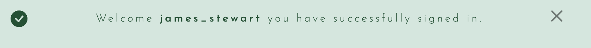

#   &nbsp;Emissions Monitoring Tool

Emissions Monitoring Tool is an application for industrial clients to monitor, verify and report any unwanted emissions that do not neccesitate an immediate shutdown to repair. .

This application is showcasing Full Stack Frameworks for Project Portfolio 4 and can be accessed by following this [link.](https://emissions-monitoring-tool-99fd7318f662.herokuapp.com/)


## Contents
<a name="contents"></a>

- [UX](#ux)
  - [Strategy](#strategy)
    - [Agile Methodology](#agile-methodology)
    - [User Stories](#user-stories)
  - [Scope](#scope)
    - [Essential Content](#essential-content)
    - [Optional Content](#optional-content)
  - [Structure](#structure)
  - [Skeleton](#structure)
    - [Wireframes](#wireframes)
  - [Surface(Design)](#surface-design)
    - [Colour Scheme](#colour-scheme)
    - [Imagery](#imagery)
    - [Logo](#logo)
    - [Typography](#typography)
- [Features](#features)
  - [Security Features](#security-features)
  - [Existing Features](#existing-features)
  - [Features Left to Implement](#features-left-to-implement)
- [Technologies Used](#technologies-used)
  - [Languages Used](#languages-used)
  - [Frameworks, Libraries & Programs Used](#frameworks-libraries--programs-used)
- [Testing](#testing)
- [Deployment](#deployment)
  - [Deploying to Heroku](#deploying-to-heroku)
  - [Forking the GitHub Repository](#forking-the-github-repository)
  - [Making a Local Clone](#making-a-local-clone)
- [Credits](#credits)
  - [Content](#content)
  - [Media](#media)

## UX
### Strategy
The objective of the site is to allow user registration, role based permissions, adding new emissions and performing regular checks on those emissions all whilst displaying the data to the user in an engaging and responsive manner.

#### Agile Methodology

The Agile Project Management approach was used in this project. Eleven epics were completed each with their own varying number of user stories. Over the course of the project, fifteen sprints were completed, selecting user stories based on a timebox value of no more than 8 per sprint. The epics, user stories and also bugs were all categorised using the Github Project Kanban board feature, which can be found [here.](https://github.com/users/johnamdickson/projects/2/views/1)

#### User Stories

The user stories were collated into eleven epics. Each user story was assigned to either the user, site admin, super user or site owner. The user stories were broken down into tasks and acceptance criteria which can be reviewed by clicking on the linked epics and user stories below.

- [Project Setup Epic](https://github.com/johnamdickson/portfolio-project-4/issues/1)
    - [As a **Site Admin** I can **deploy the project early** so that **fault finding through to deployment commences at the start of build**](https://github.com/johnamdickson/portfolio-project-4/issues/2)
    - [As a **Site Owner** I can **review wireframes** so that **site layout can be provisionally agreed**](https://github.com/johnamdickson/portfolio-project-4/issues/3)
    - [As a **Site Admin** I can **confirm that the SQL database is functional** so that **the connection to project and corresponding models is assured**](https://github.com/johnamdickson/portfolio-project-4/issues/4)

- [Basic Site Navigation Epic](https://github.com/johnamdickson/portfolio-project-4/issues/7)
    - [As a **User** I can **navigate the website** so that **I am able to access different pages with ease.**](https://github.com/johnamdickson/portfolio-project-4/issues/8)
    - [As a **User** I can **create a new account** so that **I am able to access the monitoring tool.**](https://github.com/johnamdickson/portfolio-project-4/issues/9)
    - [As a **User** I can **effortlessly sign in and sign out of my account** so that **my access to the account is secure.**](https://github.com/johnamdickson/portfolio-project-4/issues/10)

- [Site Administration Epic](https://github.com/johnamdickson/portfolio-project-4/issues/11)
    - [As a **Site Admin** I can **create, read, update and delete emissions on the provided Django panel** so that **the monitoring tool is current and reflective of emissions status**](https://github.com/johnamdickson/portfolio-project-4/issues/12)
    - [As a **Site Admin** I can **verify that emissions are locked for editing to non-superusers** so that **the monitoring tool content is locked for auditing purposes**](https://github.com/johnamdickson/portfolio-project-4/issues/13)
    - [As a **Site Admin** I can **allow certain users  to create of emissions on a linked page** so that **the monitoring tool is current and reflective of emissions status**](https://github.com/johnamdickson/portfolio-project-4/issues/14)

- [Create Home Page Epic](https://github.com/johnamdickson/portfolio-project-4/issues/15)

    - [As a **User** I can **access a summary of emissions from the back-end with a designed front-end** so that **the home page contains a useful summary of all open emissions.**](https://github.com/johnamdickson/portfolio-project-4/issues/16)
    - [As a **User** I can **view images of the emissions** so that **any ambiguity around the emission location is reduced**](https://github.com/johnamdickson/portfolio-project-4/issues/17)
    - [As a **Site Admin** I can **design the home page to match site styling** so that **the user experience is a positive and informative one**](https://github.com/johnamdickson/portfolio-project-4/issues/18)
    - [As a **Site Admin** I can **implement a map API** so that **maps showing emission location can be made available to the user.**](https://github.com/johnamdickson/portfolio-project-4/issues/22)
    - [As a **User** I can **select individual emissions** so that **I can drill down into further details**](https://github.com/johnamdickson/portfolio-project-4/issues/23)

- [Emissions Display and Interaction Epic](https://github.com/johnamdickson/portfolio-project-4/issues/19)
    - [As a **User** I can **see a list of emissions** so that **I have an overview of the facility.**](https://github.com/johnamdickson/portfolio-project-4/issues/20)
    - [As a **User** I can **filter the emissions list** so that **I can view only ones that are open.**](https://github.com/johnamdickson/portfolio-project-4/issues/21)
    - [As a **Site Admin** I can **implement a map API** so that **maps showing emission location can be made available to the user.**](https://github.com/johnamdickson/portfolio-project-4/issues/22)
    - [As a **User** I can **see a list of emissions** so that **I have an overview of the facility.**](https://github.com/johnamdickson/portfolio-project-4/issues/20)
    - [As a **Site Admin or authorised user** I can **close emissions on the emissions page** so that **the process of completing emissions once they are repaired is straight forward**](https://github.com/johnamdickson/portfolio-project-4/issues/25)
    - [As a **Site Admin** I can **delete emissions from the database on the emissions page** so that **erroneous emissions can be removed**](https://github.com/johnamdickson/portfolio-project-4/issues/26)
    - [As an **Authorised User** I can **create emissions from the emissions page** so that **new emissions can be recorded in the system**](https://github.com/johnamdickson/portfolio-project-4/issues/27)

- [Emission Checks Display and Interaction Epic](https://github.com/johnamdickson/portfolio-project-4/issues/24)

    - [As a **User** I can **easily create and complete emissions checks** so that **one of my duties as an operator can be fulfilled.**](https://github.com/johnamdickson/portfolio-project-4/issues/35)
    - [As a **Site Owner** I can **view the latest emissions checks on an emissions detail page** so that **I can verify checks are being completed at a glance for that particular emission**](https://github.com/johnamdickson/portfolio-project-4/issues/36)
    - [As a **Super User** I can **delete emissions checks** so that **erroneous emission checks can be removed from the system.**](https://github.com/johnamdickson/portfolio-project-4/issues/37)
    - [As a **Super User** I can **verify that emissions are locked for editing to non-superusers** so that **the monitoring tool content is locked for auditing purposes**](https://github.com/johnamdickson/portfolio-project-4/issues/38)
    - [As a **User and Site Admin** I can **see all emissions checks for my facility on one page** so that **I can readily access all of the the emission check history.**](https://github.com/johnamdickson/portfolio-project-4/issues/39)
    - [As a **User** I can **edit emissions checks** so that **any errors I have made can be corrected.**](https://github.com/johnamdickson/portfolio-project-4/issues/45)
    - [As a **Site Admin** I can **update emission check due dates automatically** so that **they do not have to be manually updated by users**](https://github.com/johnamdickson/portfolio-project-4/issues/46)
    - [As a **User** I can **filter checks that are open or open/closed** so that **checks on open emissions are prioritised for the user**](https://github.com/johnamdickson/portfolio-project-4/issues/66)

- [Emission Detail Page and Interaction Epic](https://github.com/johnamdickson/portfolio-project-4/issues/28)

    - [As a **User** I can **view all emission details on one page** so that **I can see all of the information that exists for it.**](https://github.com/johnamdickson/portfolio-project-4/issues/29)
    - [As a **User** I can **view the emission location on a map** so that **I can visualise the emissions location**](https://github.com/johnamdickson/portfolio-project-4/issues/30)
    - [As a **Site Owner** I can **verify permissions to close and delete emissions** so that   **they are not moved to an undesirable position in error.**](https://github.com/johnamdickson/portfolio-project-4/issues/31)
    - [As a **Site Admin and User** I can **view the relevant emission detail based on status** so that **only pertinent information is visible**](https://github.com/johnamdickson/portfolio-project-4/issues/32)

- [Maps API Epic](https://github.com/johnamdickson/portfolio-project-4/issues/33)

    - [As a **Site Admin** I can **implement a map API** so that **maps showing emission location can be made available to the user.**](https://github.com/johnamdickson/portfolio-project-4/issues/22)
    - [As a **User** I can **view the emission location on a map** so that **I can visualise the emissions location**](https://github.com/johnamdickson/portfolio-project-4/issues/30)
    - [As a **User** I can **see all of the emissions on a map** so that **their location is immediately obvious and given context with the users location.**](https://github.com/johnamdickson/portfolio-project-4/issues/34)
    - [As a **User** I can **select the emission location using a map and pin** so that **I do not need to work out the latitude and longitude manually**](https://github.com/johnamdickson/portfolio-project-4/issues/70)

- [Managing HTTP Status Codes Epic](https://github.com/johnamdickson/portfolio-project-4/issues/51)
    - [As a **Site Admin** I can **ensure users are informed of client error responses (400,403 and 404) in an informative and design friendly manner** so that **they can be made aware of the issue whilst maintaining the site aesthetic**](https://github.com/johnamdickson/portfolio-project-4/issues/53)
    - [As a **Site Admin** I can **ensure users are informed of the server error response (500) in an informative and design friendly manner** so that **they can be made aware of the issue whilst maintaining the site aesthetic**](https://github.com/johnamdickson/portfolio-project-4/issues/54)

- [Fine Tuning User Experience and Site Admin Epic](https://github.com/johnamdickson/portfolio-project-4/issues/55)
    - [As a **User** I can **scroll to the bottom of overflowing emissions tables** so that **I have a better experience of using the tables and I can visualise that there is overflow content.**](https://github.com/johnamdickson/portfolio-project-4/issues/56)
    - [As a **Site Admin** I can **provide a confirm prompt that fits with site styling** so that **users experience a fluent and seamless styling in all aspects of the site**](https://github.com/johnamdickson/portfolio-project-4/issues/57)
    - [As a **User** I can **exit form without submission using a cancel / go back button in the window as opposed to browser back button** so that **I can navigate from the site at point of use instead of using browser control.**](https://github.com/johnamdickson/portfolio-project-4/issues/58)
    - [As a **User** I can **traverse the site using commonly styled buttons** so that **the navigation experience is consistent and intuitive**](https://github.com/johnamdickson/portfolio-project-4/issues/60)
    - [As a **Site Admin** I can **condense all form htmls into a template for extension** so that **DRY principle can be adhered to.**](https://github.com/johnamdickson/portfolio-project-4/issues/61)
    - [As a **User** I can **log onto the monitoring tool with single sign on** so that **logging is a simple and secure process using a familiar log in**](https://github.com/johnamdickson/portfolio-project-4/issues/63)
    - [As a **Site Admin** I can **check a users log in status** so that **those not logged in are only able to access the home page**](https://github.com/johnamdickson/portfolio-project-4/issues/64)
    - [As a **Site Admin** I can **ensure that the add emission form contains the correct inputs** so that **unnecessary fields are removed.**](https://github.com/johnamdickson/portfolio-project-4/issues/64)

- [Testing and Documentation Epic](https://github.com/johnamdickson/portfolio-project-4/issues/72)
    - [As a **Site Admin** I can **complete manual testing** so that **all aspects of the project will be tested.**](https://github.com/johnamdickson/portfolio-project-4/issues/74)
    - [As a **Site Owner** I can **review well commented and annotated code** so that **purpose and scope of code is known now and into the future**](https://github.com/johnamdickson/portfolio-project-4/issues/82)
    - [As a **Site Owner** I can **access the project README** so that **all of the necessary information for the tool is available on project completion**](https://github.com/johnamdickson/portfolio-project-4/issues/75)


### Scope
#### Essential Content
 - A home page with emissions carousel.
 - An emissions page with list of emissions in a table.
 - An emission detail page where all emission details are presented.
 - An emission checks page with a list of checks in a table.
 - Add, edit and delete functionality for emissions and checks.
 - Sign up, login and logout pages.
#### Optional Content
- A map showing emission location on emissions, checks and detail pages.
- 
### Structure
- The structure of the postgresql database was defined and mapped out on a database schema. This helped define the required data interactions to develop a usuable product.<br><br>
.
- The front end utilises bootstrap and bespoke styling for a user friendly, designed approach. 
- Along with the database, the backend also consists of Cloudinary for image storage.
### Skeleton
#### Wireframes
- The project wireframes can be found [here.](README-files/pp4-wireframes.pdf)
### Surface (Design)
#### Colour Scheme
- The main theme colour for the site is a shade of red called *Punch*. The use of red is designed to trigger a user response given it is commonly utilised when there is a call to action. In this case, the action we want the user to perform is staying on top of emissions on their facility, something which unavoidably carries inherent risks to people, the environment and ultimately the business. Red is also closely linked with danger which ties in well with the latter risks.<br><br>


#### Imagery
- The hero image appears in the home page and was selected to convey a collaboration, supervision, industry and technology. In the image, there are two individuals in an industrial setting monitoring an item of equipment together. The image signifies operational surveillance of equipment but perhaps also the supervision aspect in that one person is showing the other something on the facility. The image is considered to one of the app's core objectives - Verify.<br><br>


- The emissions page contains a striking image adjacent to callout of an individual in an industrial setting entering data into an ipad. This image was selected to convey another of the app's core objective - Monitor.<br><br>


- All icons on the site were added to provide more engaging user experience. The main icon used in the logo and also favicon is that of a droplet, used to symbolise the purpose of the app.<br><br>


#### Logo
- The site logo utilises both the site fonts in order to create a contrast between the app name and the tag line. They are further distinguised from each other with app name being lower case and the tag line upper case. The logo is completed with the main icon inserted into the app name between emissions and monitoring, creating a more visually appealing aesthetic.<br><br>

#### Typography
- Two fonts were selected for use throughout the site. For titles and calls to action, Josefin Sans was used. The remainder of the site uses the serif font Taviraj. These fonts were imported via Google Fonts.<br><br>
<a href="#contents">BACK TO CONTENTS 🔼</a>

## Features 

### Security Features
- There are a number of features utilsed in the app to ensure the security of private information. The following information is contained in the env.py file and Heroku config vars:
  - Cloudinary URL. 
  - The database URL and secret key.
  - Allowed hosts.
- For testing, a separate cloudinary config file was required which is included in git ignore.
- The Google Maps Javascript API requires the API key to be present in the DOM in order to work. Security is assured via the Google API console where URL for local and deployed hosts is set and the API key restrictions are on.<br><br>

- There are three user types avialable in the app: emission_user, emission_admin and superuser. The two former groups were set in the Django panel and when a user registers they are automatically assigned to the emission_user group. Selection for the emission_admin group is via the Django admin panel. The different groups confer different permissiions as described below:
  - All users can view emissions and view or submit emission checks.
  - All users can edit their own checks provided it is within 24 hours of check submission. Superusers are able to edit emission checks at any time regardless of who submitted the check. 
  - Only emission admin users or superusers can close or add emissions. For all other users the respective buttons are styled to indicate unavailability.
  - Only superusers can delete emissions or checks. The buttons for this are hidden from all other users. as opposed to styling as unavailable. This is on purpose as it should not be seen as an option that regular users will be able to complete if they were to receive emission_admin status. Moreover, deletion of checks or emissions will not be a normal operation and only really considered for unforeseen errors or issues. The preference would be to close emissions instead, an option which is available to emission_admin users as desribed previously.

### Existing Features
- __Navbar__
  - The main feature of the navbar is th site logo which also comprises a link to the home page.
  - A navbar menu with dynamic links dependant on user status and permissions. If no user logged in then only login or register are visible. If user is logged in then home, emissions, checks and logout are visible. Superusers have an additional menu item called admin which directs the user to the Django admin panel.<br><br>
  
- __Footer__
  - The footer contains a link to LinkedIn, which will open in a separate tab once pressed.
  - Above the socials link is a dynamic user status display which will indicate if the user is logged in or not.<br><br>
  <br><br>
  
- __Login Page__ 
  - The login or sign in page consists of a simple form with clear instructions within a responsive container where the user can log in with ease providing a username and password.
  - The background of the form is the home page hero image, blurred and in greyscale to create a subtle link with the site.
  - Clicking on the log in button directs the user to the home page and and alert informs the user they have successfully logged in.
  - The user status in the footer updates to display the username of the currently logged in user.
  
- __Register Page__ 
  - The register or sign up page also consists of a simple form with clear instructions within a responsive container where the user can register with ease by selecting a username and password before hitting the register button.
  - As in the login page, the background of the form is the home page hero image.
  
- __Home Page__ 
  - A hero image and call out with an overview of the tool features are at the forefront of the home page to draw in the user and explain the concept of the site.<br><br>
   <br><br>
  - A multi card carousel where each card represents an emission and features the emission image and high level information: emission type and check status.<br><br>
   <br><br>
  - A modal which displays on click of the carousel card and contains the emission information for the card selected. The modal also has three buttons that allow the user to submit a check for the emission, go to the emission detail page or go to the all emissions page.<br><br>
   <br><br>
  - A carousel control with buttons for moving carousel left and right and indicators for card tracking.<br><br>
   
- __Emissions Page__ 
  - A callout with an image of an individual in an industrial setting entering data into a tablet as described in images section.
  - Adjacent to this another callout with an overview of the emissions list along with a button allowing authorised users to add an emission.<br><br>
  <br><br>
  - A table containing all filtered to open emissions on load. Each row of the table represents an individual emission which when clicked presents a modal described below. In the Emission Status header is a toggle switch which enables users to hide/unhide closed emissions.<br><br>
  
  - The table sits within a parent element div of set height meaning the table will scroll within that height. At the bottom right of the table, there are two scroll buttons which will move the table to the top and bottom extremeties when pressed. The buttons opacity dynamically changes if the table is at the position that the button is directing the table towards, giving the user feedback on button availability.<br><br>
  <br><br>
  - The modal contains buttons to submit a check for the selected emission or go to the emission detail page.<br><br>
   
- __Emission Detail Page__ 
  - The page contains a map that is centered on the site owners facility. In this case, the facility is an [abandoned fish factory](https://www.advertiser.ie/mayo/article/30821/black-day-for-westport-as-fish-factory-announces-it-is-to-close) in Westport. The map heading and zoom is set so that the facility sits square in the map div.
  - After a short delay on page load a map marker animates into position. The marker represents the actual location of the emission.
  - Clicking on the marker opens an information window with the emission title and image.<br><br>
   <br><br>
  - Beneath the map is a table containing all of the emission information. Clicking on any row opens a modal described below. Responsive styling hides less significant data on smaller screens. The table has a go back button in the header.<br><br>
  <br><br>
  - The modal has two buttons to submit a check or close the emission. The close emission button is styled unavailable for users without adequate permissions. A third delete button is visible to superusers.<br><br>
  
- __Emission Checks Page__
  - The emission check page consists of a table of all checks that when loaded shows open emissions.
  - The table has a search bar which will search for either the emission title or username and filter the table accordingly.<br><br>
    <br><br>
  - Each row of the table represents a check and when clicked opens a modal. The modal contains data for the check along with two buttons - submit a new check or edit current check.<br><br>
  <br><br>
  - The submit check button redirects the user to the submit check form page. The edit check button allows the user who submitted the check to edit the text, provided it is within 24 hours of the check's original submission. Note the superuser can edit any time and has no such restrictions.
  - If the check is by another user or the 24 hour period since submission has elapsed, the edit check button is styled to notify the user that it is unavailable.
  - As in the emissions page, the table sits within a parent element div of set height with the same behaviour as previously mentioned. There are also two scroll buttons with identical behaviour to that described in the emissions page features.<br><br>
  
- __Add Emission Page__
  - The add emission page consists of a simple form with required emission data for uploading to the database. Not the text input fields all have placeholder taxt to assist the user filling in the correct information. The form is again held within a responsive container.
  - The background of the form is same as other forms to create a link back to the site content.
  - The form contains a Go Back button for the user to easily return to the previous page.
  - On click the user is redirected to the emissions page and an alert informing the user the emission was successfully added.<br><br>
  
- __Close Emission Page__
  - The close emission page consists of a simple form with a text field for capturing close out comments. Note closing the emission is different to deleting the emission in that the expectation would be that a record is kept of emissions that are repaired. This action is strictly speaking an edit of the database record.
  - The background of the form is same as other forms to create a link back to the site content.
  - The form contains a Go Back button for the user to easily return to the previous page.
  - When the close button is clicked a confirmation dialogue appears to double check the user wants to close out the emission.
  - On closing, the user will be redirecetd to the emissions page and informed via alert that the emission has been closed.<br><br>
  
- __Submit Check Page__
  - The submit check page consists of a simple form with a drop down to select the emission status and a comments text input for uploading to the database. Not the comments input has placeholder text to assist the user filling in the correct information. The form is again held within a responsive container.
  - The background of the form is same as other forms to create a link back to the site content.
  - The form contains a Go Back button for the user to easily return to the previous page.<br><br>
  
- __Edit Check Page__
  - The close emission page consists of a simple form with a the check status and comments inputs prepopulated with data already submitted and an edit comments input field to capture reason for the edit. The edit comments input contains a placeholder text to assist the user filling in the correct information.
  - The background of the form is same as other forms to create a link back to the site content.
  - The form contains a Go Back button for the user to easily return to the previous page.
  - When the edit button is clicked a confirmation dialogue appears to double check the user wants to edit the emissions. The confirmation dialogue also repeats the edit comments for the user to check before completing the edit.
  - When edit is confirmed, the user will be redirecetd to the checks page and informed via alert that the emission has been closed.<br><br>
  
  - __Logout Page__ 
    - The logout or sign out page consists of a simple form with a prompt for the user to confirm they want to log out, within a responsive container where the user can log out by clicking the button.
    - The background of the form is the home page hero image, blurred and in greyscale to create a subtle link with the site.
    - Clicking on the log out button redirects the site back to the home page.
    - The user status in the footer will change to *no user logged in*.<br><br>
  
  - __Alerts__
    - Whenever a successful action is completed the user is informed using the built in bootstrap alert. There are four types of alert used in this project:
      - Success alert for when the user completes positive actions such as logging in or creating an emission.<br><br>
      
      - Information alert for when the user completes a non-positive actions such as deleting a check.<br><br>
      
      - Warning alert for when the user tries to complete an action that is not permitted such as trying to add an emission without the required permissions.<br><br>
      
      - Error alert for when the user has not entered the correct information into a form such as incorrect password when trying to register.<br><br>
      


### Features Left to Implement
A number of features were considered at the outset of and during the project but were shelved due to time constraints. These are detailed briefly below:
- A map in the emissions page showing the location of all emissions on the facility.
- A map in the add emission form so that the user can drop a pin at the emissions location instead of entering latitude and longitude.
- A bespoke confirmation prompt with styling more in keeping with the site aesthetic.
- Emission checks table in the emission detail page.

<a href="#contents">BACK TO CONTENTS 🔼</a>

## Technologies Used

### Languages Used
- **Python**: used extensively during project utilising the MVT (Model View Template) software design pattern.
- **Javascript**: Used for front end functionality notably the Google Maps API, conditional formatting.
- **HTML5**: Used for rendering the DOM.
- **CSS3**: Used to apply custom styling where bootstrap did not extend to the project design requirements.
- **Django Template Language**: Used within the DOM to connect with the backend and render on the page.
- **Markdown**: Used exclusively for README and TESTING.<br>

### Frameworks, Libraries & Programs Used
- **Django**: web framework to enable full stack development of this project.
- **Heroku**: cloud based platform used for site deployment.
- **elephantSQL**: cloud based database storage.
- **Cloudinary**: cloud based storage for images.
- **Bootstrap**: CSS framework for class based styling directly in the DOM.
- **dateutil**: used to calculate relative dates.
- **datetime**: from the standard library, used to perform operations on date and time objects and strings.
- **os**: from the standard library used to access system method to clear terminal screen at appropriate points whilst the program is running.
- **gunicorn**: Python HTTP server for WSGI applications.
- **json**: used to create json of instantiated model date for use in Javascript.
- **freezegun**: used to set a known date for testing.
- **jest**: used for testing Javascript.
- **Google Maps**: Javascript API required for map.
- **Gitpod** cloud based IDE used for majority of the project.
- **Git** used for version control.
- **GitHub** as cloud repository for Git version control.
- Any other libraries not explicitly mentioned here can be found in the [requirements.txt](requirements.txt) file.

<br><a href="#contents">BACK TO CONTENTS 🔼</a>
## Testing 
Testing information can be found [here.](TESTING.md)

<a href="#contents">BACK TO CONTENTS 🔼</a>

## Deployment

### Deploying to Heroku
* This site was deployed by completing the following steps:

1. Log in to [Heroku](https://id.heroku.com) or create an account.
2. On the main page click the button labelled New in the top right corner and from the drop-down menu select Create New App.
3. You must enter a unique app name.
4. Next select your region.
5. Click on the Create App button
6. The next page is the project’s Deploy Tab. Click on the Settings Tab and scroll down to Config Vars.
7. Click Reveal Config Vars and enter the following:
    - Add ALLOWED_HOSTS into the key box and in the value add in the hosting sites ie Heroku app URL.
    - Enter CLOUDINARY_URL into the next available Key box and then in the value box add the unique Cloduinary URL.
    - Enter DATABASE_URL into the next available Key box and then in the value box add the unique Database URL.
    - Enter DISABLE_COLLECTSTATIC into the next available Key box and then in the value box add 1 if this is to be disabled to prevent errors or 0 if the app is in a state where errors will not be generated.
    - Enter port into the next available Key box and 8000 into the Value box and click the Add button.
    - Enter SECRET_KEY into the next available Key box and then whichever secret key was selected into the corresponding Value box.
8. Next, scroll down to the Buildpack section click Add Buildpack select python and click Save Changes.
9. Repeat step 8 to add node.js. o Note: The Buildpacks must be in the correct order. If not click and drag them to move into the correct order.
10. Scroll to the top of the page and choose the Deploy tab.
11. Select Github as the deployment method.
12. Confirm you want to connect to GitHub.
13. Search for the repository name and click the connect button.
14. Scroll to the bottom of the deploy page and select the preferred deployment type.
15. Click either Enable Automatic Deploys for automatic deployment when you push updates to Github.

### Forking the GitHub Repository

By forking the GitHub Repository we make a copy of the original repository on our GitHub account to view and/or make changes without affecting the original repository by using the following steps:

1. Log in to GitHub and locate the [GitHub Repository.](https://github.com/johnamdickson/portfolio-project-3)
2. At the top of the Repository (not top of page) just above the "Settings" Button on the menu, locate the "Fork" Button.
3. You should now have a copy of the original repository in your GitHub account.

### Making a Local Clone

1. Log in to GitHub and locate the [GitHub Repository.](https://github.com/johnamdickson/portfolio-project-3)
2. Under the repository name, click "Clone or download".
3. To clone the repository using HTTPS, under "Clone with HTTPS", copy the link.
4. Open Git Bash
5. Change the current working directory to the location where you want the cloned directory to be made.
6. Type `git clone`, and then paste the URL you copied in Step 3.

```
$ git clone https://github.com/YOUR-USERNAME/YOUR-REPOSITORY
```

7. Press Enter. Your local clone will be created.

```
$ git clone https://github.com/YOUR-USERNAME/YOUR-REPOSITORY
> Cloning into `CI-Clone`...
> remote: Counting objects: 10, done.
> remote: Compressing objects: 100% (8/8), done.
> remove: Total 10 (delta 1), reused 10 (delta 1)
> Unpacking objects: 100% (10/10), done.
```

Click [Here](https://help.github.com/en/github/creating-cloning-and-archiving-repositories/cloning-a-repository#cloning-a-repository-to-github-desktop) to retrieve pictures for some of the buttons and more detailed explanations of the above process.<br><br>
<a href="#contents">BACK TO CONTENTS 🔼</a>
## Credits 
### Content 
NOTE: Specific links are included within the Python, HTML, CSS  files. The list below summarises content credits in general.
- Stack Overflow, W3 Docs and other online resources were a massive help for Python, HTML or CSS code that enabled some of the functionality I was looking for.
- This [website](https://www.scaler.com/topics/multiline-comment-in-python/) gave guidance for making multi-line comments where using `“””` is recommended for docstrings and using `#` for comments.

- Thanks to my tutor Graham for his advice during the mentoring sessions.

### Media
- Google Fonts.
- All gifs were generated on [ezgif.com.](https://ezgif.com/video-to-gif)
- The hero image was <a href="https://www.freepik.com/free-photo/engineer-cooperation-male-female-technician-maintenance-control-relay-robot-arm-system-welding-with-tablet-laptop-control-quality-operate-process-work-heavy-industry-40-manufacturing-factory_25118263.htm#page=2&query=industry%20ipad%20check&position=24&from_view=search&track=ais"> by Lifestylememory</a> on Freepik

- The colour names were sourced from [Name That Color.](https://chir.ag/projects/name-that-color/)
- The site colour scheme pallete was generated using the palette creation tool in [Color Hex.](https://www.color-hex.com/) 
- The title icons were from [Favicon](https://favicon.io/) which in turn sourced them from [Twemoji.](https://twemoji.twitter.com/)

<br><br>
<a href="#contents">BACK TO CONTENTS 🔼</a>
