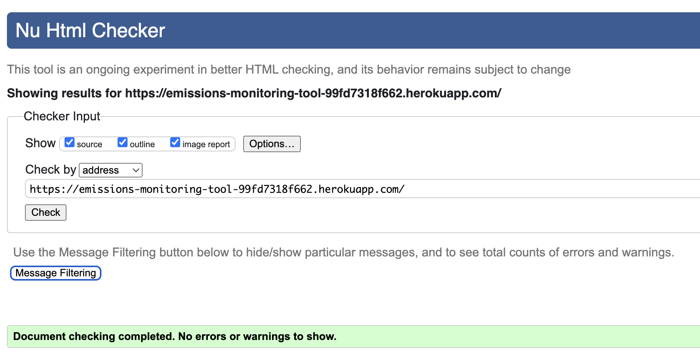
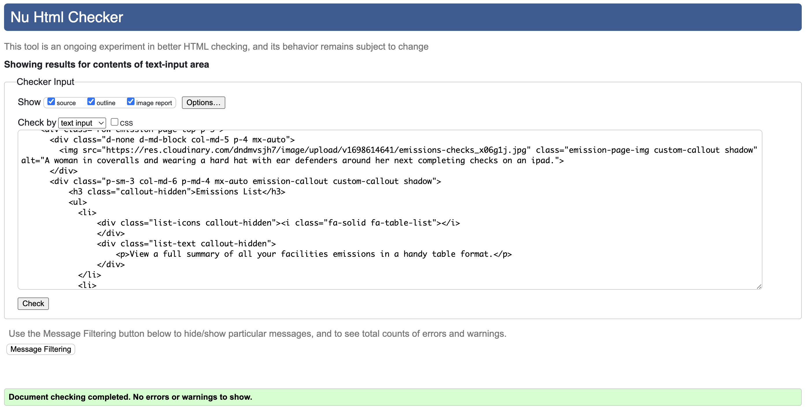

# Table of Contents
- [User Story Testing](#user-story-testing)
- [Validator Testing](#validator-testing)
  * [HTML](#html)
    + [Fixed Errors](#fixed-errors)
    + [Unfixed Errors](#unfixed-errors)
  * [CSS](#css)
  * [Javascript](#javascript)
  * [Python](#python)
  * [Lighthouse](#lighthouse)
- [Browser Testing](#browser-testing)
- [Device Testing](#device-testing)
- [Automated Testing]
- [Manual Testing](#manual-testing)
- [Bugs](#bugs)
  * [Fixed Bugs](#fixed-bugs)

  * [Unfixed bugs:](#unfixed-bugs-)

## Validator Testing

### HTML

All HTML pages were run through the [W3C HTML Validator](https://validator.w3.org/) with the home page checked using address and every other page using page source text input. The results can be found in the table below:

**Page**|**First Pass**|**Warnings/Errors**|**Second Pass**|**Screenshot**
:-----:|:-----:|:-----|:-----:|:-----:
 | index.html| ❌ | Warning: Consider adding a lang attribute to the html start tag to declare the language of this document.  Info: Trailing slash on void elements has no effect and interacts badly with unquoted attribute values.   Error: An img element must have an alt attribute, except under certain conditions. Error: Stray end tag div. Error: Stray start tag tr. Error: The aria-labelledby attribute must point to an element in the same document.| ✅ |
 | emissions.html| ❌ |Error: An img element must have an alt attribute, except under certain conditions. Error: Attribute value missing. Error: End tag div seen, but there were open elements. Error: No space between attributes. Error: Bad value `${checkEmissionUrl}` for attribute href on element a: Illegal character in path segment: { is not allowed.   Error: Bad value `${allEmissionsUrl}` for attribute href on element a: Illegal character in path segment: { is not allowed. Error: Stray end tag div. Warning: Section lacks heading. Consider using h2-h6 elements to add identifying headings to all sections, or else use a div element instead for any cases where no heading is needed. Error: The aria-labelledby attribute must point to an element in the same document. | ✅| 
 | | | 
 | | | 
 | | | 
 | | | 
 | | | 
