# Table of Contents
- [User Story Testing](#user-story-testing)
  * [Project Setup Epic](#project-setup-epic)
  * [Basic Site Navigation Epic](#basic-site-navigation-epic)
  * [Site Administration Epic](#site-administration-epic)
  * [Create Home Page Epic](#create-home-page-epic)
  * [Emissions Display and Interaction Epic](#emissions-display-and-interaction-epic)
  * [Emission Checks Display and Interaction Epic](#emission-checks-display-and-interaction-epic)
  * [Emission Detail Page and Interaction Epic](#emission-detail-page-and-interaction-epic)
- [Validator Testing](#validator-testing)
  * [HTML](#html)
  * [CSS](#css)
  * [Javascript](#javascript)
  * [Python](#python)
  * [Lighthouse](#lighthouse)
- [Browser Testing](#browser-testing)
- [Device Testing](#device-testing)
- [Automated Testing](#automated-testing)
- [Manual Testing](#manual-testing)
- [Bugs](#bugs)
  * [Fixed Bugs](#fixed-bugs)
  * [Unfixed bugs:](#unfixed-bugs-)

## User Story Testing

### [Project Setup Epic](https://github.com/johnamdickson/portfolio-project-4/issues/1)
**User Story**|**Test**|**Result**|**Evidence**
:------|:------|:----:|:-----:
[As a **Site Admin** I can **deploy the project early** so that **fault finding through to deployment commences at the start of build**](https://github.com/johnamdickson/portfolio-project-4/issues/2)|Project was deployed to Heroku with an `<h1>` of Heroku Test added to the DOM. This was confirmed to be present on deployment| ✅| 
[As a **Site Owner** I can **review wireframes** so that **site layout can be provisionally agreed**](https://github.com/johnamdickson/portfolio-project-4/issues/3) |Wireframes developed and uploaded to repository for review.|✅|Click [here](README-files/pp4-wireframes.pdf) to access the wireframes.
[As a **Site Admin** I can **confirm that the SQL database is functional** so that **the connection to project and corresponding models is assured**](https://github.com/johnamdickson/portfolio-project-4/issues/4)|Database created in Elephant SQL and confirmed operational from project by creating an emission and emission check in the Django admin panel and then confirming they appear in the DB|✅| 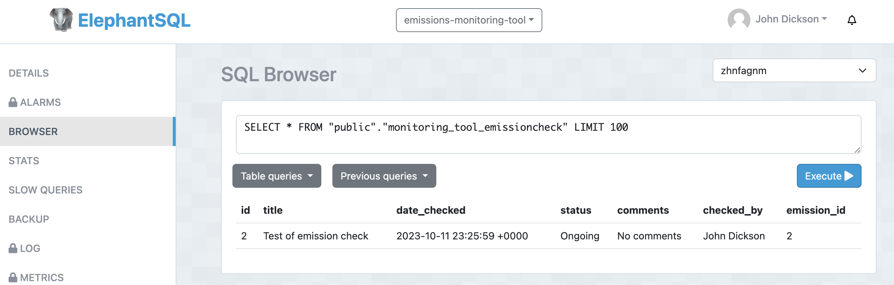 

### [Basic Site Navigation Epic](https://github.com/johnamdickson/portfolio-project-4/issues/7)
**User Story**|**Test**|**Result**|**Evidence**
:------|:------|:----:|:-----:
[As a **User** I can **navigate the website** so that **I am able to access different pages with ease.**](https://github.com/johnamdickson/portfolio-project-4/issues/8)|Navbar created and HTML structure set up in templates for required pages.|✅| 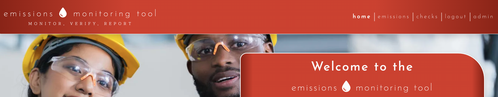 
[As a **User** I can **create a new account** so that **I am able to access the monitoring tool.**](https://github.com/johnamdickson/portfolio-project-4/issues/9)|A signup page exists with a form for the new user to fill out and submit.|✅|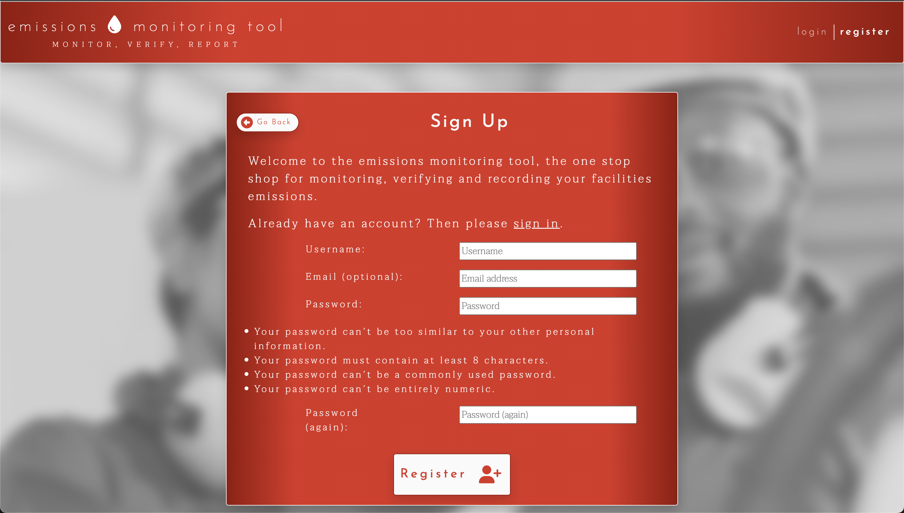 
[As a **User** I can **effortlessly sign in and sign out of my account** so that **my access to the account is secure.**](https://github.com/johnamdickson/portfolio-project-4/issues/10)|Login and logout pages exist which are easily accessible from the navbar.|✅| 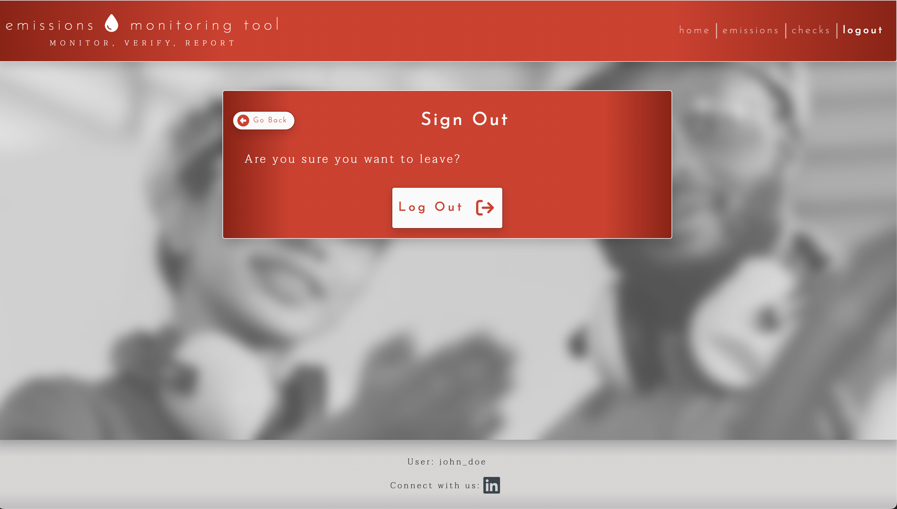 

### [Site Administration Epic](https://github.com/johnamdickson/portfolio-project-4/issues/11)
**User Story**|**Test**|**Result**|**Evidence**
:------|:------|:----:|:-----:
[As a **Site Admin** I can **create, read, update and delete emissions on the provided Django panel** so that **the monitoring tool is current and reflective of emissions status**](https://github.com/johnamdickson/portfolio-project-4/issues/12)|Test emission and test emission check added to database from Django admin page.|✅|  
[As a **Site Admin** I can **verify that emissions are locked for editing to non-superusers** so that **the monitoring tool content is locked for auditing purposes**](https://github.com/johnamdickson/portfolio-project-4/issues/13)|Time based deletion deemed unnecessary, preferring time based editing instead.|❌|N/A
[As a **Site Admin** I can **allow certain users  to create of emissions on a linked page** so that **the monitoring tool is current and reflective of emissions status**](https://github.com/johnamdickson/portfolio-project-4/issues/14)|Two different users groups created: emission_user and emission_admin. The emission_admin user is able to add a new emission whilst the emission_user is not. When a new user is created, they are automatically assigned to the emission_user group.|✅|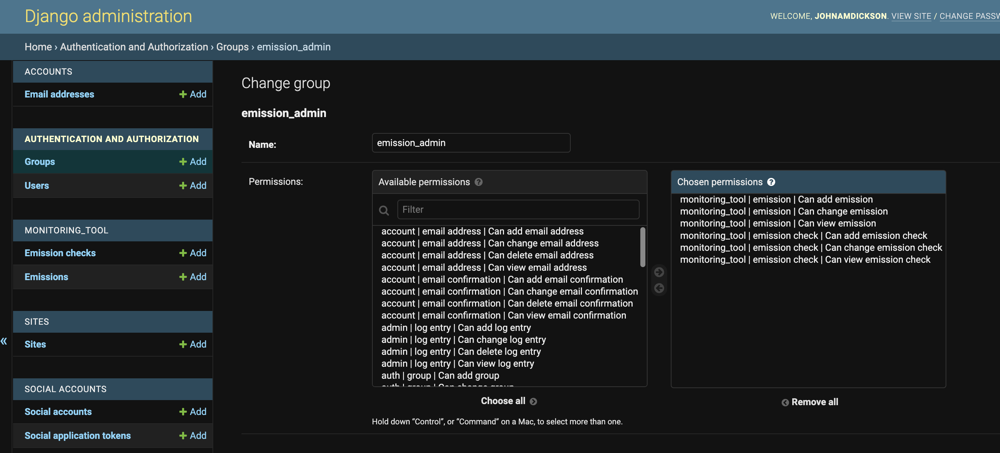  

### [Create Home Page Epic](https://github.com/johnamdickson/portfolio-project-4/issues/15)
**User Story**|**Implemented**|**Result**|**Evidence**
:------|:------|:----:|:-----:
[As a **User** I can **access a summary of emissions from the back-end with a designed front-end** so that **the home page contains a useful summary of all open emissions.**](https://github.com/johnamdickson/portfolio-project-4/issues/16)|A bootstrap carousel was implemented with a card for each emission that the user can scroll through.|✅|
[As a **User** I can **view images of the emissions** so that **any ambiguity around the emission location is reduced**](https://github.com/johnamdickson/portfolio-project-4/issues/17)|Emission image url as Cloudinaryfield in Emission model. Cloudinary account set up to store all images. Home page carousel displays the emissions image.|✅|
[As a **Site Admin** I can **design the home page to match site styling** so that **the user experience is a positive and informative one**](https://github.com/johnamdickson/portfolio-project-4/issues/18)|Hero image selected to fit with the site theme. A callout added on top of hero image with styling to match the navbar and clearly displaying the site purpose.|✅|
[As a **Site Admin** I can **implement a map API** so that **maps showing emission location can be made available to the user.**](https://github.com/johnamdickson/portfolio-project-4/issues/22)|User story moved to Map API Epic.|❌|N/A
[As a **User** I can **select individual emissions** so that **I can drill down into further details**](https://github.com/johnamdickson/portfolio-project-4/issues/23)|Modal created on home page with additional information from back end. The information is presented in a table and an image is visible at the top of the modal. There is also a button for submission of emission checks which references the title of the modal emission.|✅|

### [Emissions Display and Interaction Epic](https://github.com/johnamdickson/portfolio-project-4/issues/19)
**User Story**|**Test**|**Result**|**Evidence**
:------|:------|:----:|:-----:
[As a **User** I can **see a list of emissions** so that **I have an overview of the facility.**](https://github.com/johnamdickson/portfolio-project-4/issues/20)|On the emissions page there is a table detailing all of the emissions stored in the database.|✅|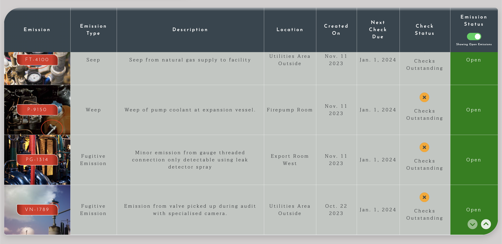
[As a **User** I can **filter the emissions list** so that **I can view only ones that are open.**](https://github.com/johnamdickson/portfolio-project-4/issues/21)|On the emissions table there is a toggle switch which will hide/unhide closed emissions.|✅|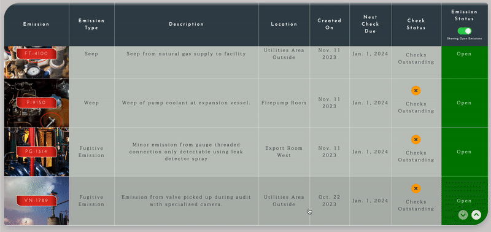
[As a **Site Admin** I can **implement a map API** so that **maps showing emission location can be made available to the user.**](https://github.com/johnamdickson/portfolio-project-4/issues/22)|User story moved to Map API Epic.|❌|N/A
[As a **User** I can **see a list of emissions** so that **I have an overview of the facility.**](https://github.com/johnamdickson/portfolio-project-4/issues/20)|On the emissions page there is a table detailing all of the emissions stored in the database.|✅|
[As a **Site Admin or authorised user** I can **close emissions on the emissions page** so that **the process of completing emissions once they are repaired is straight forward**](https://github.com/johnamdickson/portfolio-project-4/issues/25)|User story moved to Emission Detail Display and Interaction|❌|N/A
[As a **Site Admin** I can **delete emissions from the database on the emissions page** so that **erroneous emissions can be removed**](https://github.com/johnamdickson/portfolio-project-4/issues/26)|User story moved to Emission Detail Display and Interaction|❌|N/A
[As an **Authorised User** I can **create emissions from the emissions page** so that **new emissions can be recorded in the system**](https://github.com/johnamdickson/portfolio-project-4/issues/27)|On the emissions page there is a button in the callout for adding an emission. The button is styled dependant on the user permissions. If an unauthorised user presses the button a message appears informing them that they do not have the necessary permissions.|✅|

### [Emission Checks Display and Interaction Epic](https://github.com/johnamdickson/portfolio-project-4/issues/24)
**User Story**|**Test**|**Result**|**Evidence**
:------|:------|:----:|:-----:
[As a **User** I can **easily create and complete emissions checks** so that **one of my duties as an operator can be fulfilled.**](https://github.com/johnamdickson/portfolio-project-4/issues/35)|There are buttons to submit a check from home page modal, emission detail modal or the emission checks page. The button links the user to a Submit Check form which once submitted is added to the database and the user is notified after being redirected to the checks page.|✅|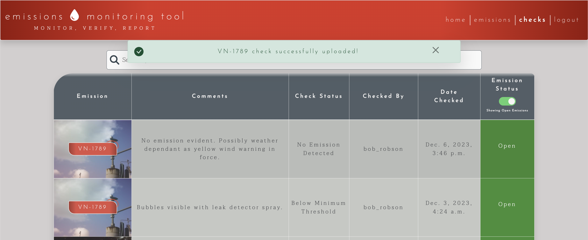
[As a **Site Owner** I can **view the latest emissions checks on an emissions detail page** so that **I can verify checks are being completed at a glance for that particular emission**](https://github.com/johnamdickson/portfolio-project-4/issues/36)|A table of all emission checks exists on the emissions checks page of the site and is ordered by date the check was created.|✅|
[As a **Super User** I can **delete emissions checks** so that **erroneous emission checks can be removed from the system.**](https://github.com/johnamdickson/portfolio-project-4/issues/37)|A delete check button is available to only the superuser which when pressed generates a prompt to confirm deletion.|✅|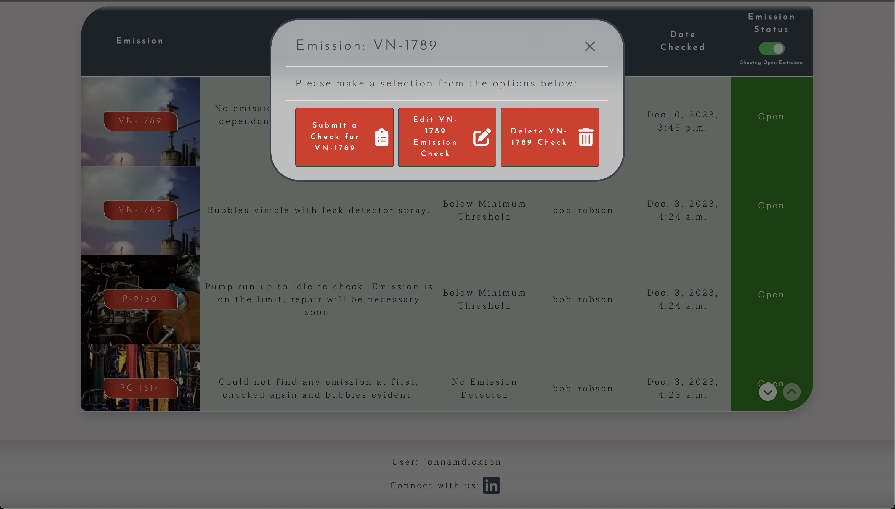
[As a **Super User** I can **verify that emissions are locked for editing to non-superusers** so that **the monitoring tool content is locked for auditing purposes**](https://github.com/johnamdickson/portfolio-project-4/issues/38)|A time based option for editing exists for non-superusers which entails a 24 hour period for editing checks thereafter the option is not available.|✅|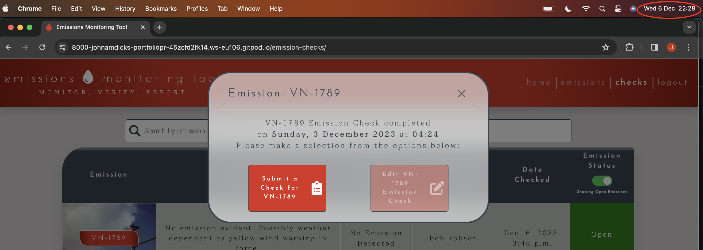
[As a **User and Site Admin** I can **see all emissions checks for my facility on one page** so that **I can readily access all of the the emission check history.**](https://github.com/johnamdickson/portfolio-project-4/issues/39)|The table mentioned in previous user story exists and also has a search bar to filter per emission or username.|✅|
[As a **User** I can **edit emissions checks** so that **any errors I have made can be corrected.**](https://github.com/johnamdickson/portfolio-project-4/issues/45)|An editing function exists as described previously. Only users can update the checks they submitted (superusers can update all). Editing completed using form page and there is a confirmation alert generated prior to submission.|✅|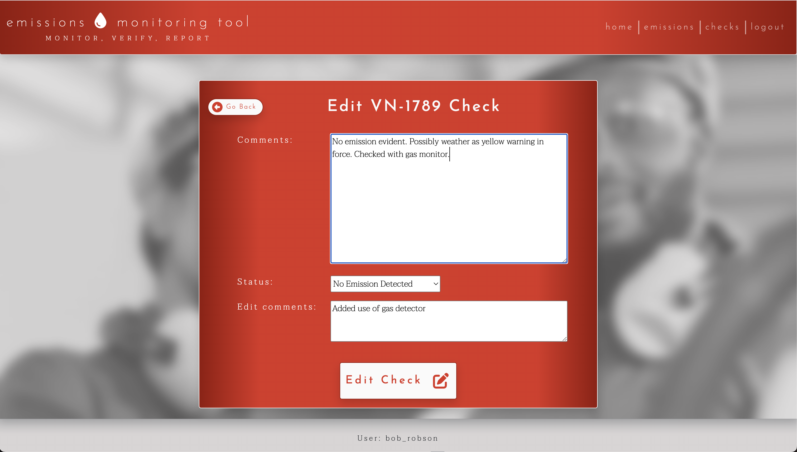
[As a **Site Admin** I can **update emission check due dates automatically** so that **they do not have to be manually updated by users**](https://github.com/johnamdickson/portfolio-project-4/issues/46)|The FirstMonday class contains methods to automatically calculate the current and next checks due. Theses methods are accessed in the emission detail page and also when creating a new emission and will updates the respective fields in the database without requiring any input from the user.|✅|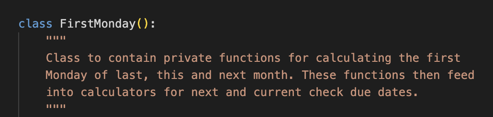
[As a **User** I can **filter checks that are open or open/closed** so that **checks on open emissions are prioritised for the user**](https://github.com/johnamdickson/portfolio-project-4/issues/66)|On the emission checks table there is a toggle switch which will hide/unhide checks associated with closed emissions.|✅|

### [Emission Detail Page and Interaction Epic](https://github.com/johnamdickson/portfolio-project-4/issues/28)
**User Story**|**Test**|**Result**|**Evidence**
:------|:------|:----:|:-----:
[As a **User** I can **view all emission details on one page** so that **I can see all of the information that exists for it.**](https://github.com/johnamdickson/portfolio-project-4/issues/29)|An emission detail page exists for each emission with a table containing all the information related to that particular emission.|✅|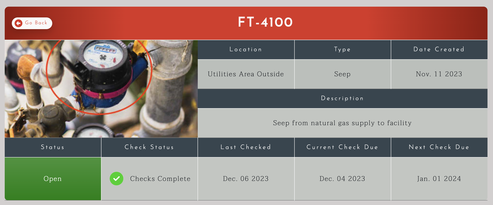
[As a **User** I can **view the emission location on a map** so that **I can visualise the emissions location**](https://github.com/johnamdickson/portfolio-project-4/issues/30)|A map view exists on the emission detail page with a marker indicating the location of the emission.|✅|
[As a **Site Owner** I can **verify permissions to close and delete emissions** so that   **they are not moved to an undesirable position in error.**](https://github.com/johnamdickson/portfolio-project-4/issues/31)|Options to close and delete emissions are based on user status. An emission_user cannot close nor delete, an emission_admin can close but not delete whilst a superuser can both close and delete an emission. This is reflected in the styling of the respective buttons.|✅|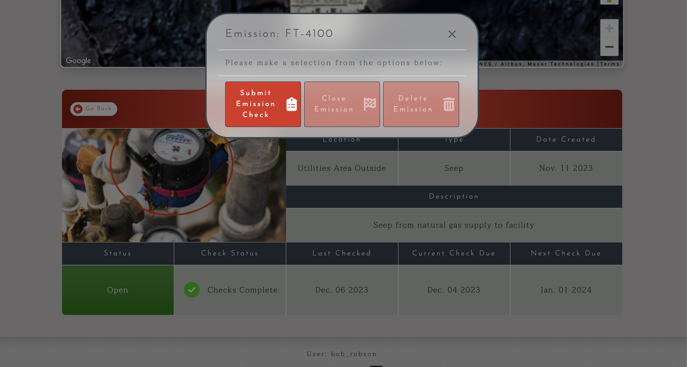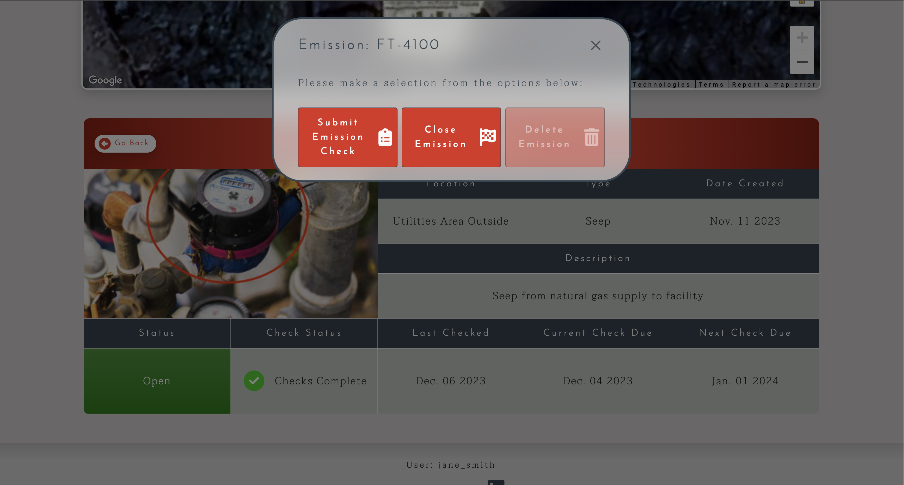
[As a **Site Admin and User** I can **view the relevant emission detail based on status** so that **only pertinent information is visible**](https://github.com/johnamdickson/portfolio-project-4/issues/32)|Emission detail tables are formatted to display relevant information based upon the emission status being open or closed.|✅|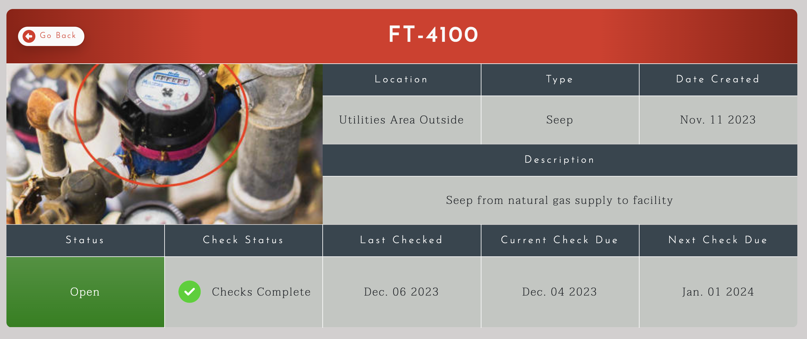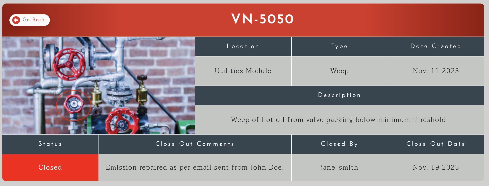

[As a **Site Admin** I can **implement a map API** so that **maps showing emission location can be made available to the user.**](https://github.com/johnamdickson/portfolio-project-4/issues/22)|Map API added to project and confirmed operational on the emission-detail page.|✅|
## Validator Testing

### HTML

All HTML pages were checked using the [W3C HTML Validator](https://validator.w3.org/) with the home, login and signup pages checked using address and every other page using page source text input. The text input was obtained by navaigating to the page to test and then right clicking on the window. From the menu, the view page source option was selected which opened a new tab containing the DOM for the page. The test was then performed by copying and pasting the code into the text input field in the validator.

Results for all HTML pages can be found in the table below:

**Page**|**First Pass**|**Warnings/Errors**|**Second Pass (Post Fix)**|**Screenshot**
:-----:|:-----:|:-----|:-----:|:-----:
 | index| ❌ |Warning: Consider adding a lang attribute to the html start tag to declare the language of this document.  Info: Trailing slash on void elements has no effect and interacts badly with unquoted attribute values.   Error: An img element must have an alt attribute, except under certain conditions. Error: Stray end tag div. Error: Stray start tag tr. Error: The aria-labelledby attribute must point to an element in the same document.| ✅ | 
 | emissions| ❌ |Error: An img element must have an alt attribute, except under certain conditions. Error: Attribute value missing. Error: End tag div seen, but there were open elements. Error: No space between attributes. Error: Bad value `${checkEmissionUrl}` for attribute href on element a: Illegal character in path segment: { is not allowed.   Error: Bad value `${allEmissionsUrl}` for attribute href on element a: Illegal character in path segment: { is not allowed. Error: Stray end tag div. Warning: Section lacks heading. Consider using h2-h6 elements to add identifying headings to all sections, or else use a div element instead for any cases where no heading is needed. Error: The aria-labelledby attribute #must point to an element in the same document. | ✅| 
 |emission-detail| ❌ | Error: Element p not allowed as child of element button in this context. (Suppressing further errors from this subtree.)   Error: The element h4 must not appear as a descendant of the th element.   Error: The element h5 must not appear as a descendant of the th element.  Error: Duplicate attribute class. Error: Stray end tag div. Error: The aria-labelledby attribute must point to an element in the same document. Error: Bad value 100% for attribute width on element img: Expected a digit but saw % instead.| ✅| 
 |emission-checks | ❌ | Error: No space between attributes. Warning: Section lacks heading. Consider using h2-h6 elements to add identifying headings to all sections, or else use a div element instead for any cases where no heading is needed.  Error: Bad value `${checkEmissionUrl}` for attribute href on element a: Illegal character in path segment: { is not allowed.  Error: Bad value `${allEmissionsUrl}` for attribute href on element a: Illegal character in path segment: { is not allowed. Stray end tag div. Error: The aria-labelledby attribute must point to an element in the same document.| ✅|  
 | login | ❌ |Error: Stray end tag div.  Error: Element p not allowed as child of element button in this context. (Suppressing further errors from this subtree.)  Error: Bad value for attribute action on element form: Must be non-empty. Error: End tag main seen, but there were open elements. Error: Unclosed element div. | ✅ |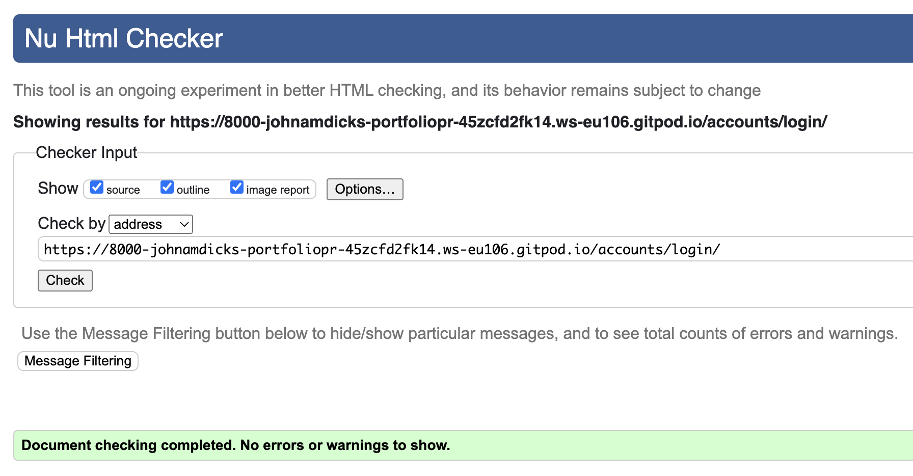 
 | logout|❌  | Error: End tag main seen, but there were open elements. Error: Unclosed element div.|✅ | 
 | signup| ❌| Error: Stray end tag div. Error: Duplicate ID help-text. Error: End tag main seen, but there were open elements. Error: Unclosed element div.|✅ |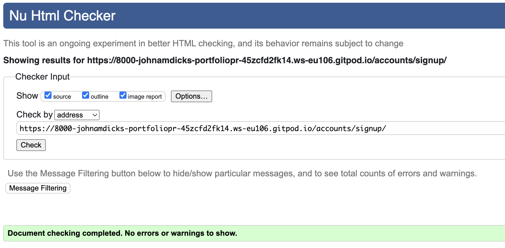 
 | add-emission| ❌| Error: Bad value for attribute action on element form: Must be non-empty. Error: End tag main seen, but there were open elements. Error: Unclosed element div. Error: Stray end tag a.|✅ | 
 | add-check| ❌| Error: Bad value for attribute action on element form: Must be non-empty.  Error: End tag main seen, but there were open elements. Error: Unclosed element div.|✅ |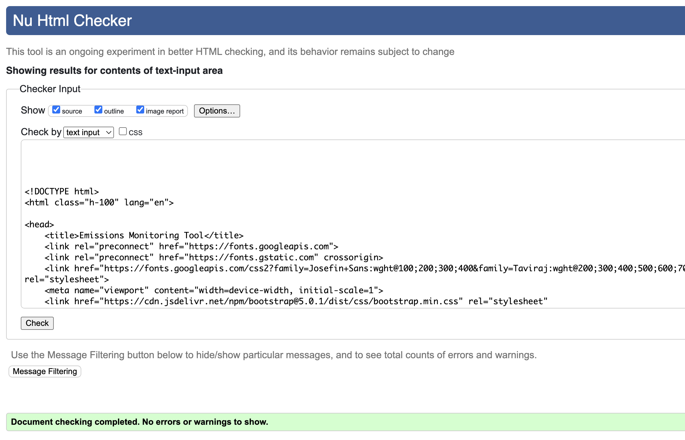 
 | close-emission| ✅| N/A| N/A |  
   | edit-check| ✅| N/A| N/A |   
  | 400 error| ✅| N/A| N/A | 
  | 403 error| ✅| N/A| N/A |  
  | 404 error| ✅| N/A| N/A |  
  | 500 error| ✅| N/A| N/A | 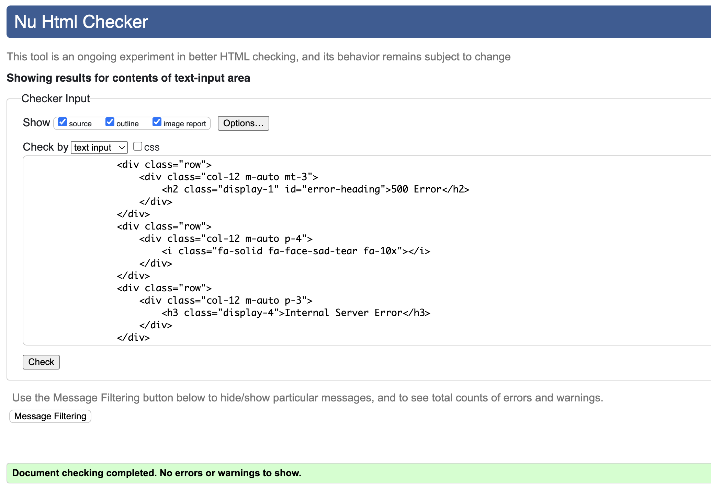 

### CSS

The site CSS was checked using the [W3C CSS Validator](https://jigsaw.w3.org/css-validator/). There were 220 warnings assoiated with Bootstrap CSS and 6 in static CSS file associated with webkit code. These warnings are unavoidable in the validator because they are vendor extensions. However, looking at feedback given to other students on Slack who had a similar issue, it appears to be safe to ignore these warnings. 

The warnings and errors that are detailed in the table below reflect problems within the static CSS file and were duly corrected.

**First Pass**|**Errors**|**Warnings**|**Second Pass (Post Fix)**|**Screenshot**
:-----:|:-----|:-----|:-----:|:-----:
| ❌|Property opaity doesn't exist. The closest matching property name is opacity : 0  Property size doesn't exist. The closest matching property name is resize : 50px Property size doesn't exist. The closest matching property name is resize : 50px|.go-back-btn	Same color for background-color and color  .go-back-button Same color for background-color and border-color|✅| 

### Javascript

The site Javascsript functionality was checked using [JS Hint](https://jshint.com/)

**File**|**Warnings**|**Warnings Remaining (Post Fix)**|**Screenshot**
|:-----:|:-----|:-----|:-----:|
script.js |Warnings returned, click [here](TESTING-files/javascript-validator/script-errors.md) to view|Two undefined variables: bootstrap and google. No action taken as they are vendor API Two unused variables: no action taken as they are all called from DOM events that pass over data from the templates to JS code.|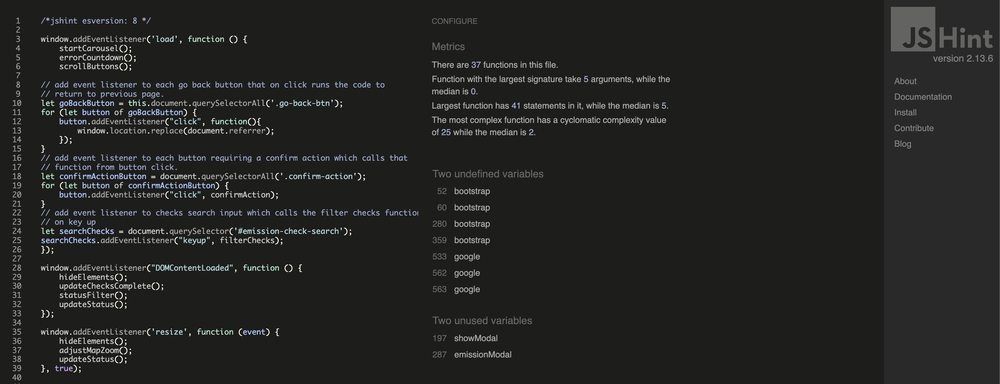 
script.test.js |Warnings returned, click [here](TESTING-files/javascript-validator/script.test-errors.md) to view|Ten warnings were ignored. Six warnings are attributable to the google maps api and the remaining four are related to Jest testing code Six undefined variables: no action taken as they are all Jest function calls.|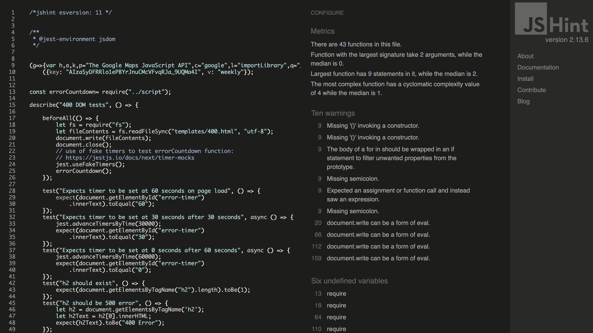 

### Python

Each of the site Python files were passed through the [Code Institute Python Linter](https://pep8ci.herokuapp.com/). Initial errors can be found in this file. The table below list each file with screenshot of the results after resolving errors and warnings.

**File**|**Initial Errors/Warnings**|**Screenshot**
|:-----:|:------|:-----:|
|asgi.py|N/A|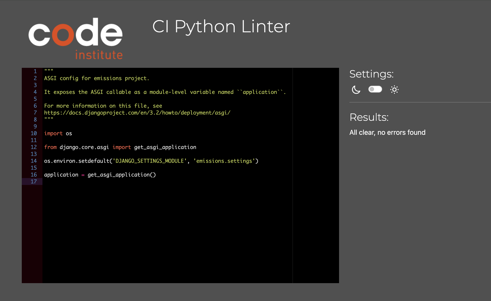
|settings.py|Errors/warnings returned, click [here](TESTING-files/python-validator/settings-errors.md) to view|
|emissions/urls.py|N/A|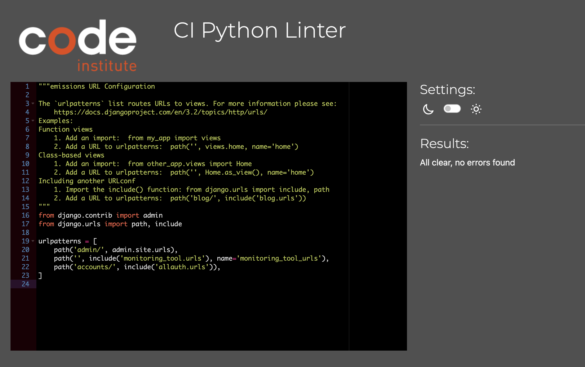
|wsgi.py|N/A|
|admin.py|Errors/warnings returned, click [here](TESTING-files/python-validator/admin-errors.md) to view|
|apps.py|N/A|
|forms.py|Errors/warnings returned, click [here](TESTING-files/python-validator/forms-errors.md) to view|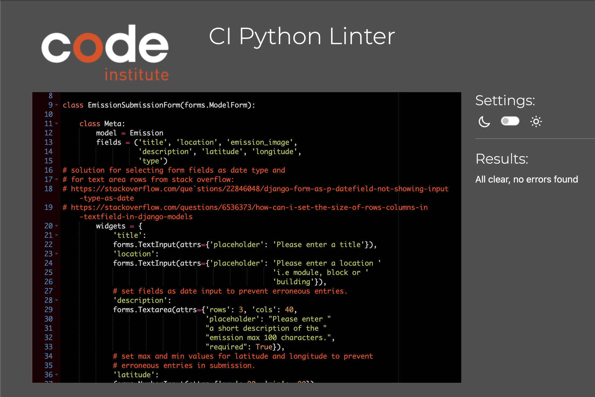
|models.py|Errors/warnings returned, click [here](TESTING-files/python-validator/models-errors.md) to view|
|tests.py|Errors/warnings returned, click [here](TESTING-files/python-validator/tests-errors.md) to view|
|monitoring_tool/urls.py|Errors/warnings returned, click [here](TESTING-files/python-validator/monitoring_tool-urls-errors.md) to view|
|views.py|Errors/warnings returned, click [here](TESTING-files/python-validator/views-errors.md) to view|

### Lighthouse

All HTML pages were checked using [Chrome DevTools Lighthouse](https://developer.chrome.com/docs/lighthouse/overview/). The results were generally optimal for desktop devices as shown in the table below. The status code pages returned an error on Lighthouse in Navigation mode, possibly owing to the fact that they redirect after a countdown period. Based on their content simplicity and the fact they should be rarely accessed, the Snapshot mode was selected. Each page returned the same score which is shown at the bottom of the table.

For mobile devices, the performance score was in the 60-70 region. This was improved by changing the image format to webp and moving all scripts to bottom of body with the exeption of those essential to the page function. The Google maps API also affected performance, especially on the emissions detail page where the map is rendered. Upon researching this performance dip it would appear that this is commonplace and to be expected without any countermeasures involving workarounds. These countermeasures and any further alterations towards improving the mobile performance score were considered but in the interests of project progress this was not implemented.
**File**|**Desktop Results**|**Mobile Results**|
|:-----:|:-----:|:-----:|
|index.html||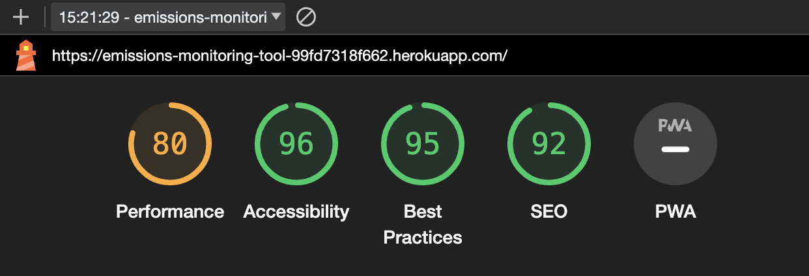
|emissions.html|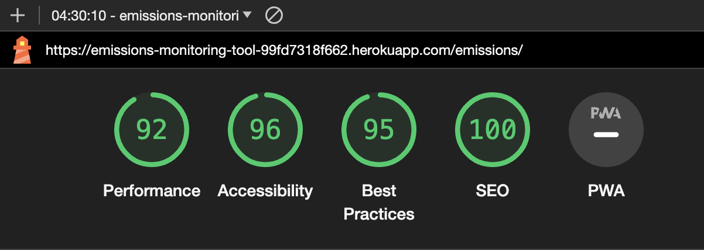|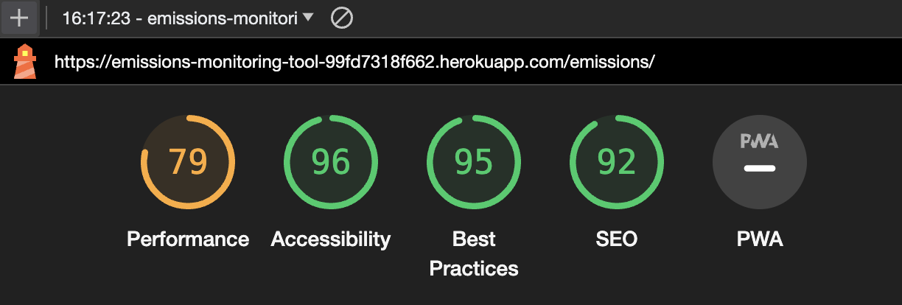
|emission-detail.html||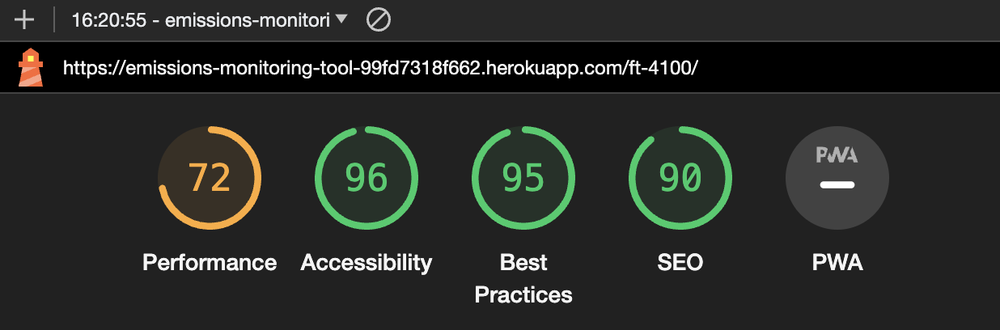
|emission-checks.html|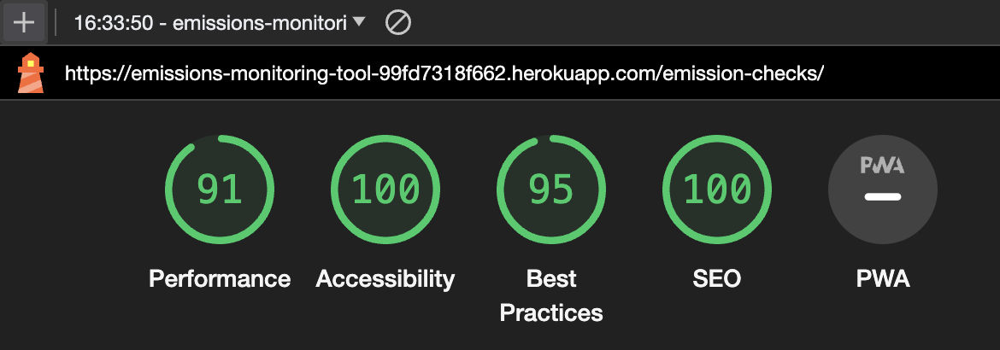|
|login.html||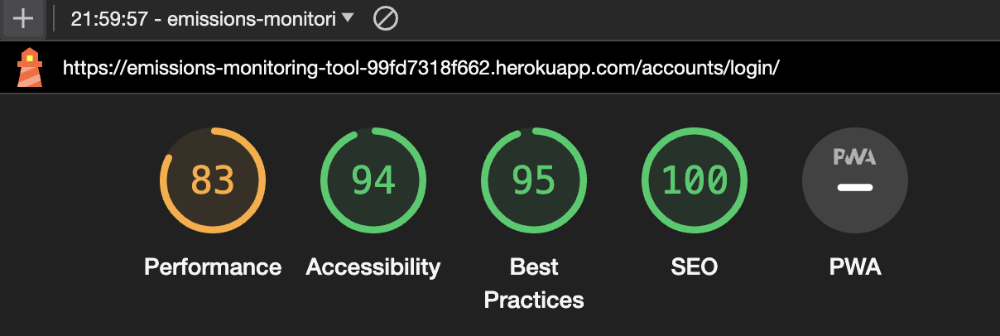
|logout.html||
|signup.html||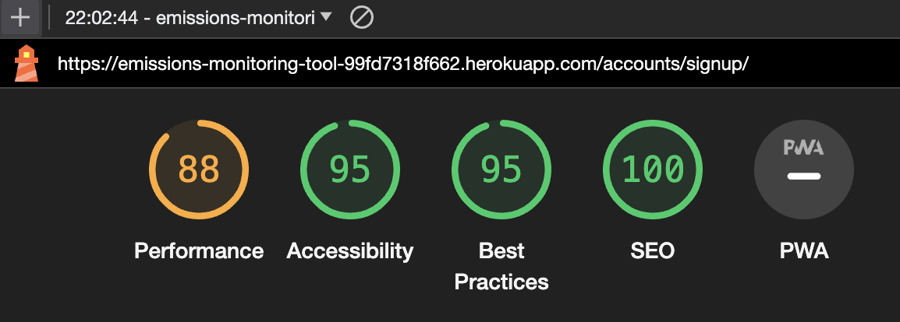
error-pages||
