# Table of Contents
- [User Story Testing](#user-story-testing)
  * [Project Setup Epic](#project-setup-epic)
  * [Basic Site Navigation Epic](#basic-site-navigation-epic)
  * [Site Administration Epic](#site-administration-epic)
  * [Create Home Page Epic](#create-home-page-epic)
  * [Emissions Display and Interaction Epic](#emissions-display-and-interaction-epic)
  * [Emission Checks Display and Interaction Epic](#emission-checks-display-and-interaction-epic)
  * [Emission Detail Page and Interaction Epic](#emission-detail-page-and-interaction-epic)
  * [Maps API Epic](#maps-api-epic)
  * [Managing HTTP Status Codes Epic](#managing-http-status-codes-epic)
  * [Fine Tuning User Experience and Site Admin Epic](#fine-tuning-user-experience-and-site-admin-epic)
- [Validator Testing](#validator-testing)
  * [HTML](#html)
  * [CSS](#css)
  * [Javascript](#javascript)
  * [Python](#python)
  * [Lighthouse](#lighthouse)
- [Responsiveness Testing](#responsiveness-testing)
  * [Browser Testing](#browser-testing)
  * [Device Testing](#device-testing)
- [Automated Testing](#automated-testing)
  * [Python Automated Testing](#python-automated-testing)
  * [Javascript Automated Testing](#javascript-automated-testing)
- [Manual Testing](#manual-testing)
  * [Home Page](#home-page)
  * [Emissions Page](#emissions-page)
  * [Checks Page](#checks-page)
- [Bugs](#bugs)
  * [Fixed Bugs](#fixed-bugs)
  * [Unfixed bugs:](#unfixed-bugs-)

## User Story Testing

### [Project Setup Epic](https://github.com/johnamdickson/portfolio-project-4/issues/1)
**User Story**|**Test**|**Result**|**Evidence**
:------|:------|:----:|:-----:
[As a **Site Admin** I can **deploy the project early** so that **fault finding through to deployment commences at the start of build**](https://github.com/johnamdickson/portfolio-project-4/issues/2)|Project was deployed to Heroku with an `<h1>` of Heroku Test added to the DOM. This was confirmed to be present on deployment| ✅|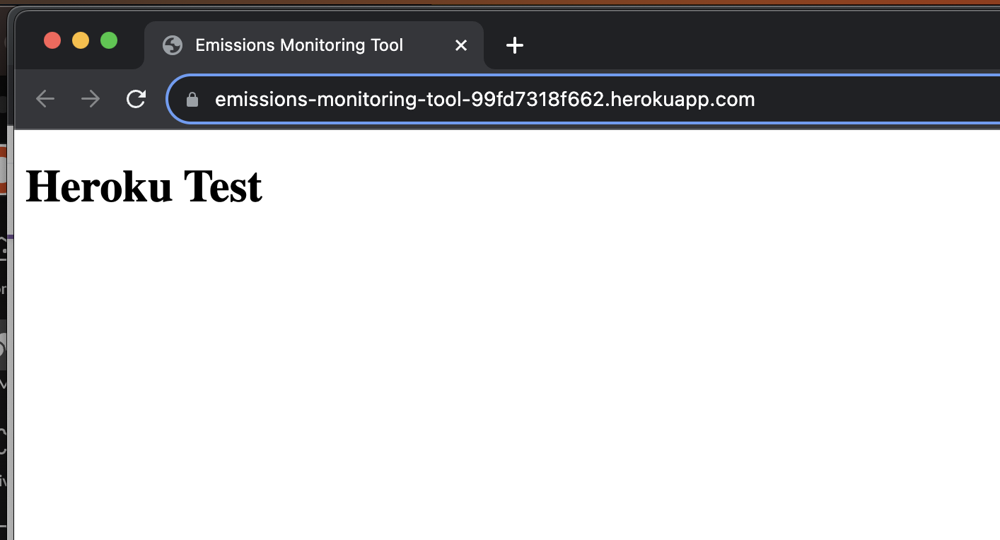 
[As a **Site Owner** I can **review wireframes** so that **site layout can be provisionally agreed**](https://github.com/johnamdickson/portfolio-project-4/issues/3) |Wireframes developed and uploaded to repository for review.|✅|Click [here](README-files/pp4-wireframes.pdf) to access the wireframes.
[As a **Site Admin** I can **confirm that the SQL database is functional** so that **the connection to project and corresponding models is assured**](https://github.com/johnamdickson/portfolio-project-4/issues/4)|Database created in Elephant SQL and confirmed operational from project by creating an emission and emission check in the Django admin panel and then confirming they appear in the DB|✅|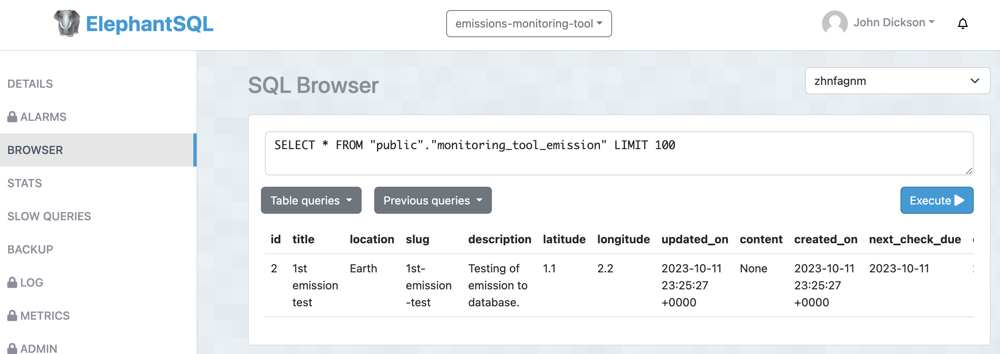  

### [Basic Site Navigation Epic](https://github.com/johnamdickson/portfolio-project-4/issues/7)
**User Story**|**Test**|**Result**|**Evidence**
:------|:------|:----:|:-----:
[As a **User** I can **navigate the website** so that **I am able to access different pages with ease.**](https://github.com/johnamdickson/portfolio-project-4/issues/8)|Navbar created and HTML structure set up in templates for required pages.|✅|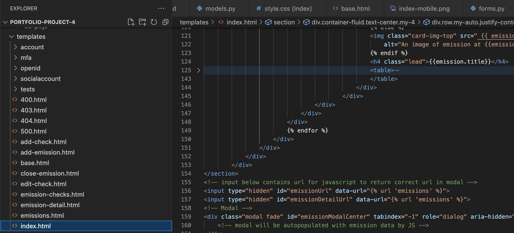  
[As a **User** I can **create a new account** so that **I am able to access the monitoring tool.**](https://github.com/johnamdickson/portfolio-project-4/issues/9)|A signup page exists with a form for the new user to fill out and submit.|✅| 
[As a **User** I can **effortlessly sign in and sign out of my account** so that **my access to the account is secure.**](https://github.com/johnamdickson/portfolio-project-4/issues/10)|Login and logout pages exist which are easily accessible from the navbar.|✅|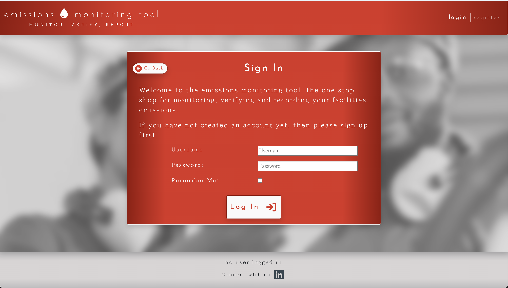  

### [Site Administration Epic](https://github.com/johnamdickson/portfolio-project-4/issues/11)
**User Story**|**Test**|**Result**|**Evidence**
:------|:------|:----:|:-----:
[As a **Site Admin** I can **create, read, update and delete emissions on the provided Django panel** so that **the monitoring tool is current and reflective of emissions status**](https://github.com/johnamdickson/portfolio-project-4/issues/12)|Test emission and test emission check added to database from Django admin page.|✅|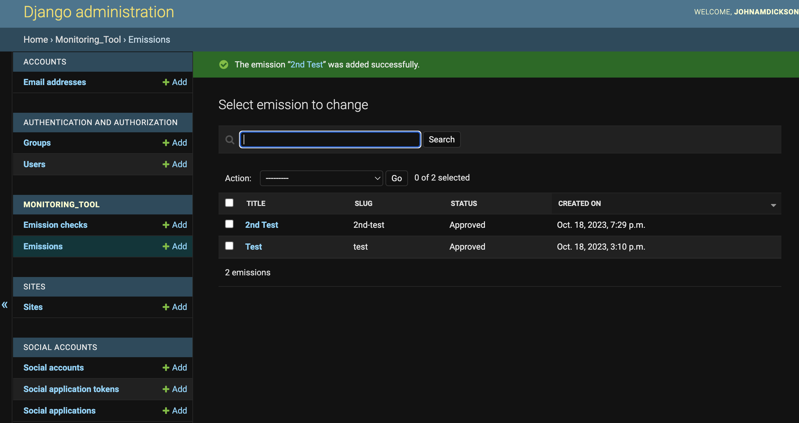  
[As a **Site Admin** I can **verify that emissions are locked for editing to non-superusers** so that **the monitoring tool content is locked for auditing purposes**](https://github.com/johnamdickson/portfolio-project-4/issues/13)|Time based deletion deemed unnecessary, preferring time based editing instead.|❌|N/A
[As a **Site Admin** I can **allow certain users  to create of emissions on a linked page** so that **the monitoring tool is current and reflective of emissions status**](https://github.com/johnamdickson/portfolio-project-4/issues/14)|Two different users groups created: emission_user and emission_admin. The emission_admin user is able to add a new emission whilst the emission_user is not. When a new user is created, they are automatically assigned to the emission_user group.|✅| 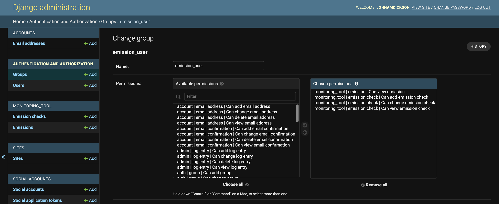 

### [Create Home Page Epic](https://github.com/johnamdickson/portfolio-project-4/issues/15)
**User Story**|**Implemented**|**Result**|**Evidence**
:------|:------|:----:|:-----:
[As a **User** I can **access a summary of emissions from the back-end with a designed front-end** so that **the home page contains a useful summary of all open emissions.**](https://github.com/johnamdickson/portfolio-project-4/issues/16)|A bootstrap carousel was implemented with a card for each emission that the user can scroll through.|✅|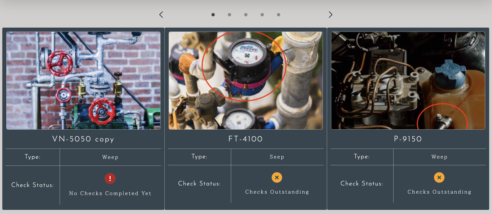
[As a **User** I can **view images of the emissions** so that **any ambiguity around the emission location is reduced**](https://github.com/johnamdickson/portfolio-project-4/issues/17)|Emission image url as Cloudinaryfield in Emission model. Cloudinary account set up to store all images. Home page carousel displays the emissions image.|✅|
[As a **Site Admin** I can **design the home page to match site styling** so that **the user experience is a positive and informative one**](https://github.com/johnamdickson/portfolio-project-4/issues/18)|Hero image selected to fit with the site theme. A callout added on top of hero image with styling to match the navbar and clearly displaying the site purpose.|✅|
[As a **Site Admin** I can **implement a map API** so that **maps showing emission location can be made available to the user.**](https://github.com/johnamdickson/portfolio-project-4/issues/22)|User story moved to Map API Epic.|❌|N/A
[As a **User** I can **select individual emissions** so that **I can drill down into further details**](https://github.com/johnamdickson/portfolio-project-4/issues/23)|Modal created on home page with additional information from back end. The information is presented in a table and an image is visible at the top of the modal. There is also a button for submission of emission checks which references the title of the modal emission.|✅|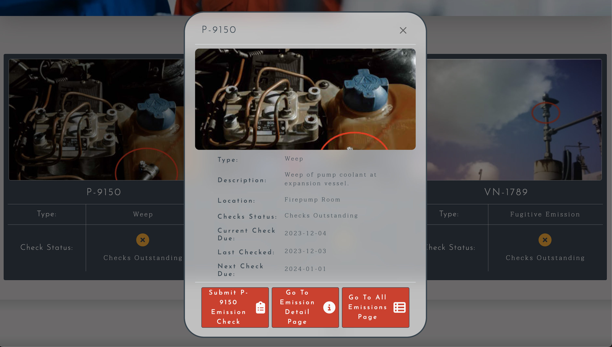

### [Emissions Display and Interaction Epic](https://github.com/johnamdickson/portfolio-project-4/issues/19)
**User Story**|**Test**|**Result**|**Evidence**
:------|:------|:----:|:-----:
[As a **User** I can **see a list of emissions** so that **I have an overview of the facility.**](https://github.com/johnamdickson/portfolio-project-4/issues/20)|On the emissions page there is a table detailing all of the emissions stored in the database.|✅|
[As a **User** I can **filter the emissions list** so that **I can view only ones that are open.**](https://github.com/johnamdickson/portfolio-project-4/issues/21)|On the emissions table there is a toggle switch which will hide/unhide closed emissions.|✅|
[As a **Site Admin** I can **implement a map API** so that **maps showing emission location can be made available to the user.**](https://github.com/johnamdickson/portfolio-project-4/issues/22)|User story moved to Map API Epic.|❌|N/A
[As a **User** I can **see a list of emissions** so that **I have an overview of the facility.**](https://github.com/johnamdickson/portfolio-project-4/issues/20)|On the emissions page there is a table detailing all of the emissions stored in the database.|✅|
[As a **Site Admin or authorised user** I can **close emissions on the emissions page** so that **the process of completing emissions once they are repaired is straight forward**](https://github.com/johnamdickson/portfolio-project-4/issues/25)|User story moved to Emission Detail Display and Interaction|❌|N/A
[As a **Site Admin** I can **delete emissions from the database on the emissions page** so that **erroneous emissions can be removed**](https://github.com/johnamdickson/portfolio-project-4/issues/26)|User story moved to Emission Detail Display and Interaction|❌|N/A
[As an **Authorised User** I can **create emissions from the emissions page** so that **new emissions can be recorded in the system**](https://github.com/johnamdickson/portfolio-project-4/issues/27)|On the emissions page there is a button in the callout for adding an emission. The button is styled dependant on the user permissions. If an unauthorised user presses the button a message appears informing them that they do not have the necessary permissions.|✅|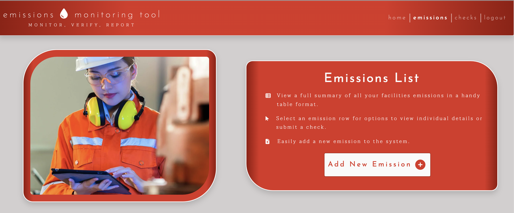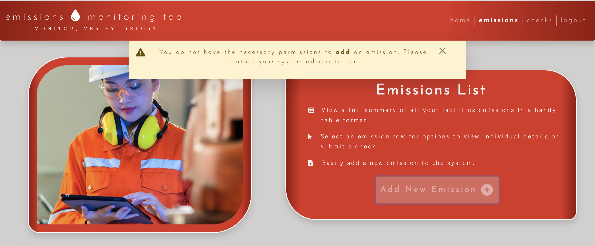

### [Emission Checks Display and Interaction Epic](https://github.com/johnamdickson/portfolio-project-4/issues/24)
**User Story**|**Test**|**Result**|**Evidence**
:------|:------|:----:|:-----:
[As a **User** I can **easily create and complete emissions checks** so that **one of my duties as an operator can be fulfilled.**](https://github.com/johnamdickson/portfolio-project-4/issues/35)|There are buttons to submit a check from home page modal, emission detail modal or the emission checks page. The button links the user to a Submit Check form which once submitted is added to the database and the user is notified after being redirected to the checks page.|✅|
[As a **Site Owner** I can **view the latest emissions checks on an emissions detail page** so that **I can verify checks are being completed at a glance for that particular emission**](https://github.com/johnamdickson/portfolio-project-4/issues/36)|A table of all emission checks exists on the emissions checks page of the site and is ordered by date the check was created.|✅|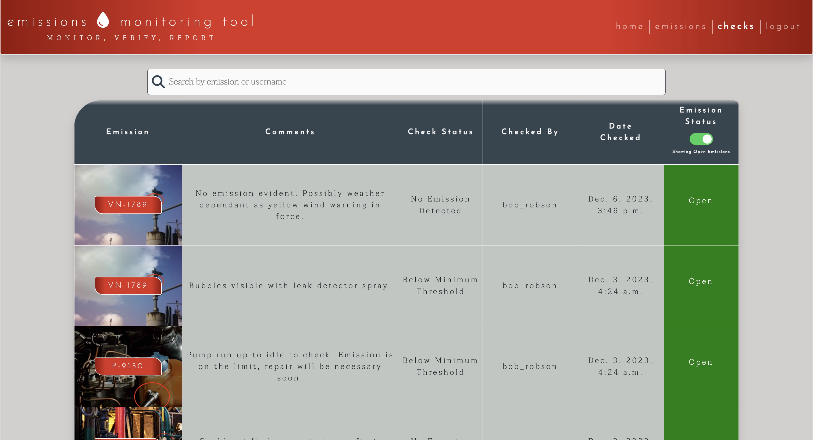
[As a **Super User** I can **delete emissions checks** so that **erroneous emission checks can be removed from the system.**](https://github.com/johnamdickson/portfolio-project-4/issues/37)|A delete check button is available to only the superuser which when pressed generates a prompt to confirm deletion.|✅|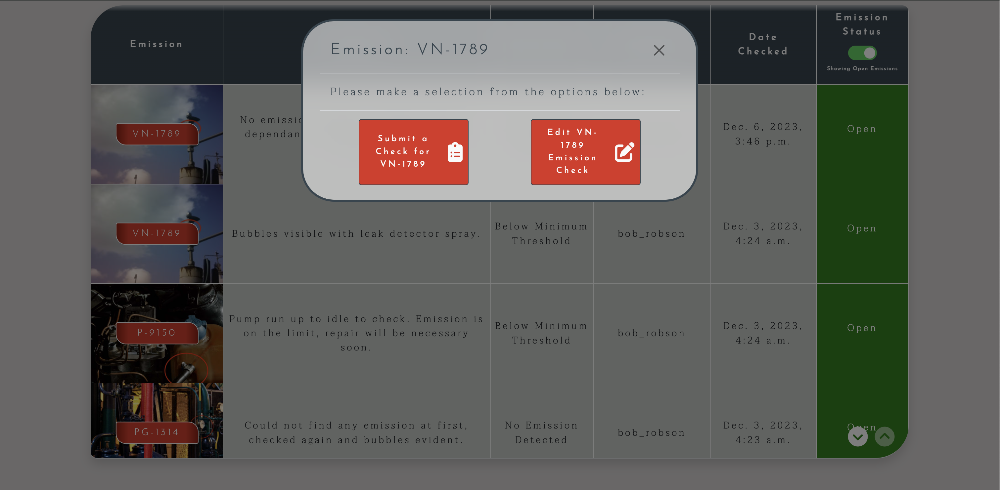
[As a **Super User** I can **verify that emissions are locked for editing to non-superusers** so that **the monitoring tool content is locked for auditing purposes**](https://github.com/johnamdickson/portfolio-project-4/issues/38)|A time based option for editing exists for non-superusers which entails a 24 hour period for editing checks thereafter the option is not available.|✅|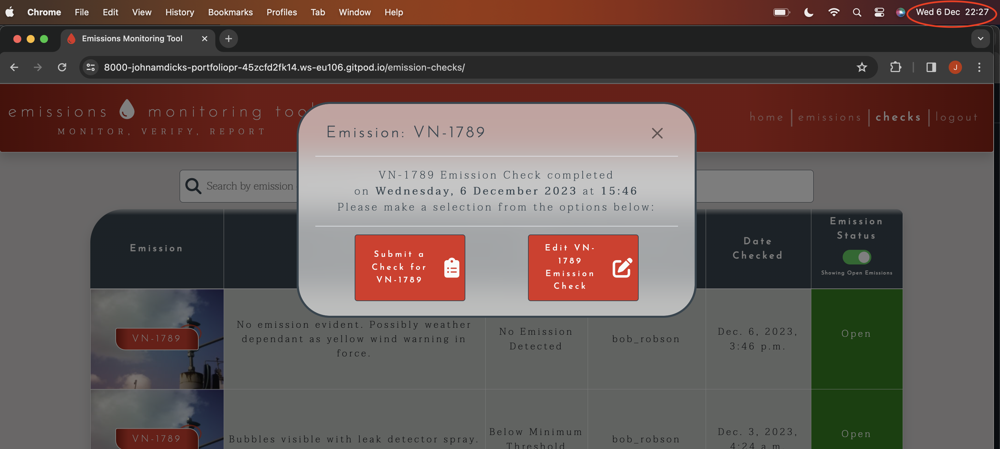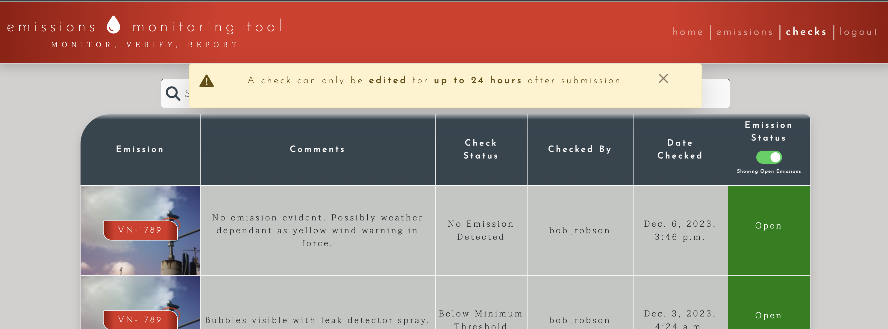
[As a **User and Site Admin** I can **see all emissions checks for my facility on one page** so that **I can readily access all of the the emission check history.**](https://github.com/johnamdickson/portfolio-project-4/issues/39)|The table mentioned in previous user story exists and also has a search bar to filter per emission or username.|✅|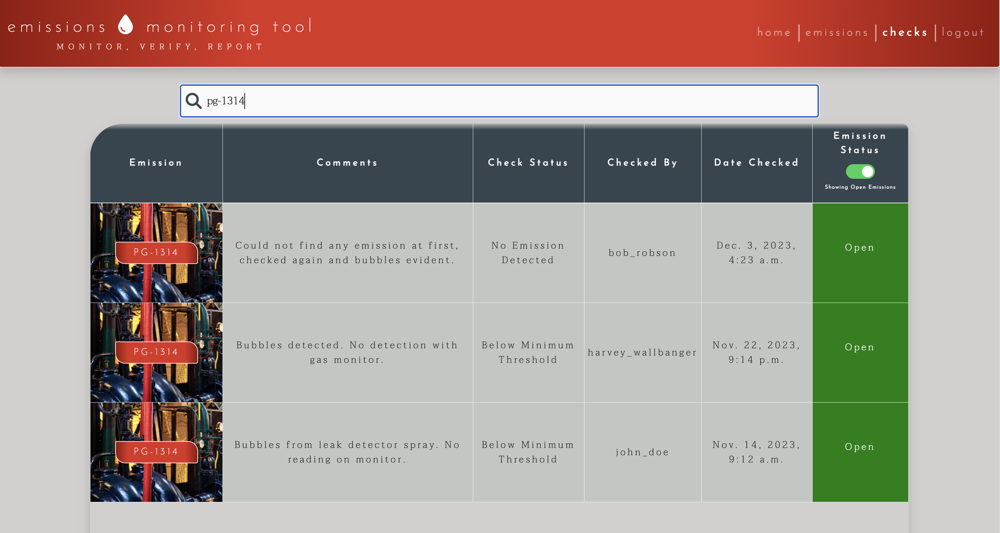
[As a **User** I can **edit emissions checks** so that **any errors I have made can be corrected.**](https://github.com/johnamdickson/portfolio-project-4/issues/45)|An editing function exists as described previously. Only users can update the checks they submitted (superusers can update all). Editing completed using form page and there is a confirmation alert generated prior to submission.|✅|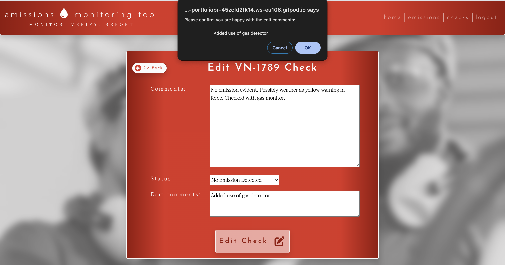
[As a **Site Admin** I can **update emission check due dates automatically** so that **they do not have to be manually updated by users**](https://github.com/johnamdickson/portfolio-project-4/issues/46)|The FirstMonday class contains methods to automatically calculate the current and next checks due. Theses methods are accessed in the emission detail page and also when creating a new emission and will updates the respective fields in the database without requiring any input from the user.|✅|
[As a **User** I can **filter checks that are open or open/closed** so that **checks on open emissions are prioritised for the user**](https://github.com/johnamdickson/portfolio-project-4/issues/66)|On the emission checks table there is a toggle switch which will hide/unhide checks associated with closed emissions.|✅|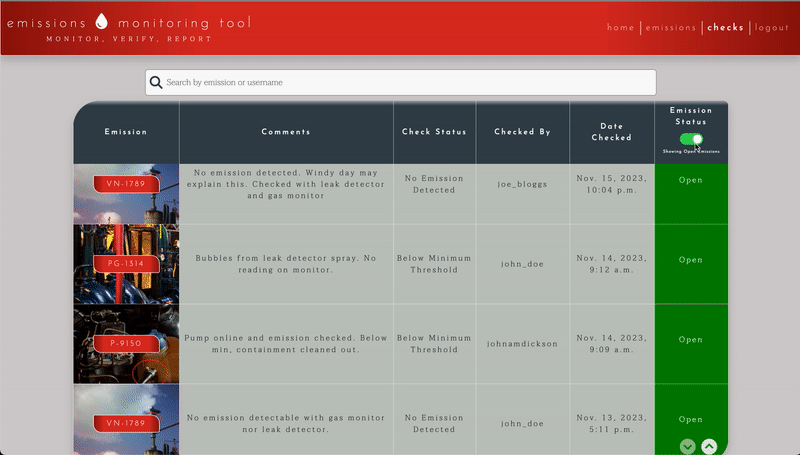

### [Emission Detail Page and Interaction Epic](https://github.com/johnamdickson/portfolio-project-4/issues/28)
**User Story**|**Test**|**Result**|**Evidence**
:------|:------|:----:|:-----:
[As a **User** I can **view all emission details on one page** so that **I can see all of the information that exists for it.**](https://github.com/johnamdickson/portfolio-project-4/issues/29)|An emission detail page exists for each emission with a table containing all the information related to that particular emission.|✅|
[As a **User** I can **view the emission location on a map** so that **I can visualise the emissions location**](https://github.com/johnamdickson/portfolio-project-4/issues/30)|A map view exists on the emission detail page with a marker indicating the location of the emission.|✅|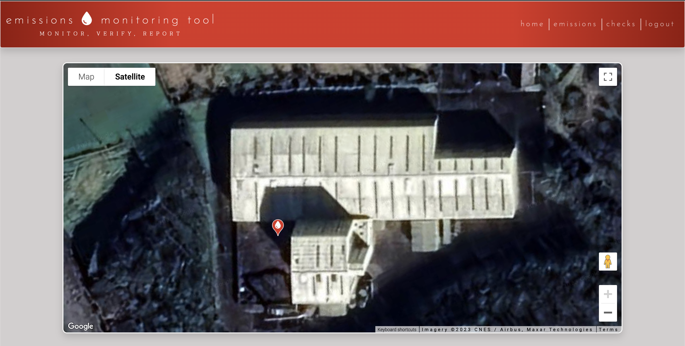
[As a **Site Owner** I can **verify permissions to close and delete emissions** so that   **they are not moved to an undesirable position in error.**](https://github.com/johnamdickson/portfolio-project-4/issues/31)|Options to close and delete emissions are based on user status. An emission_user cannot close nor delete, an emission_admin can close but not delete whilst a superuser can both close and delete an emission. This is reflected in the styling of the respective buttons.|✅|
[As a **Site Admin and User** I can **view the relevant emission detail based on status** so that **only pertinent information is visible**](https://github.com/johnamdickson/portfolio-project-4/issues/32)|Emission detail tables are formatted to display relevant information based upon the emission status being open or closed.|✅|

### [Maps API Epic](https://github.com/johnamdickson/portfolio-project-4/issues/33)
**User Story**|**Test**|**Result**|**Evidence**
:------|:------|:----:|:-----:
[As a **Site Admin** I can **implement a map API** so that **maps showing emission location can be made available to the user.**](https://github.com/johnamdickson/portfolio-project-4/issues/22)|Map API added to project and confirmed operational on the emission-detail page.|✅|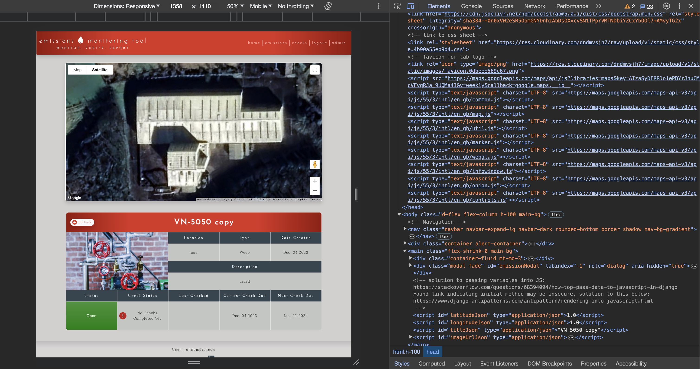
[As a **User** I can **view the emission location on a map** so that **I can visualise the emissions location**](https://github.com/johnamdickson/portfolio-project-4/issues/30)|Map added to emission detail page.|✅|
[As a **User** I can **see all of the emissions on a map** so that **their location is immediately obvious and given context with the users location.**](https://github.com/johnamdickson/portfolio-project-4/issues/34)|User story will not be implemented in this version of the app.|❌|N/A
[As a **User** I can **select the emission location using a map and pin** so that **I do not need to work out the latitude and longitude manually**](https://github.com/johnamdickson/portfolio-project-4/issues/70)|User story will not be implemented in this version of the app.|❌|N/A

### [Managing HTTP Status Codes Epic](https://github.com/johnamdickson/portfolio-project-4/issues/51)
**User Story**|**Test**|**Result**|**Evidence**
:------|:------|:----:|:-----:
[As a **Site Admin** I can **ensure users are informed of client error responses (400,403 and 404) in an informative and design friendly manner** so that **they can be made aware of the issue whilst maintaining the site aesthetic**](https://github.com/johnamdickson/portfolio-project-4/issues/53)|A separate page exists for 400, 403 and 404 errors which all are triggered by the appropriate error and are formatted to suit the site styling.|✅|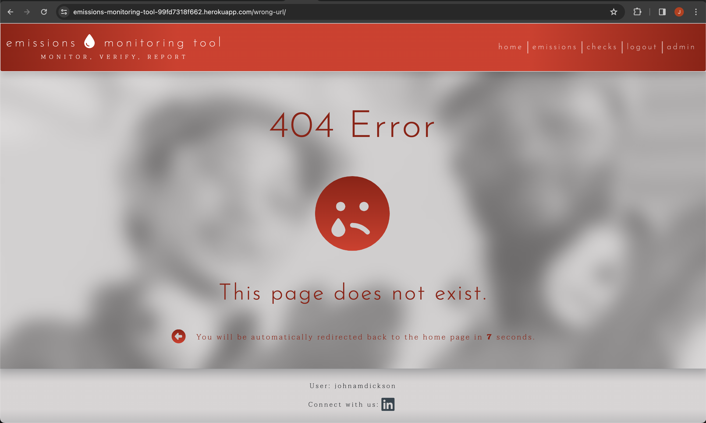
[As a **Site Admin** I can **ensure users are informed of the server error response (500) in an informative and design friendly manner** so that **they can be made aware of the issue whilst maintaining the site aesthetic**](https://github.com/johnamdickson/portfolio-project-4/issues/54)|A page exists for 500 error code which iw triggered by the appropriate error and is formatted to suit the site styling.|✅|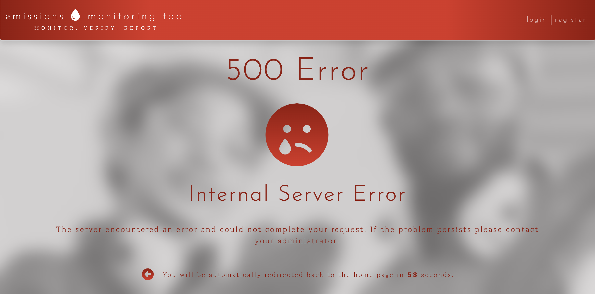

### [Fine Tuning User Experience and Site Admin Epic](https://github.com/johnamdickson/portfolio-project-4/issues/55)
**User Story**|**Test**|**Result**|**Evidence**
:------|:------|:----:|:-----:
[As a **User** I can **scroll to the bottom of overflowing emissions tables** so that **I have a better experience of using the tables and I can visualise that there is overflow content.**](https://github.com/johnamdickson/portfolio-project-4/issues/56)|Both the emissions and emissions checks tables have scroll buttons that are styled dynamically to indicate whereabouts in the table the user is.|✅|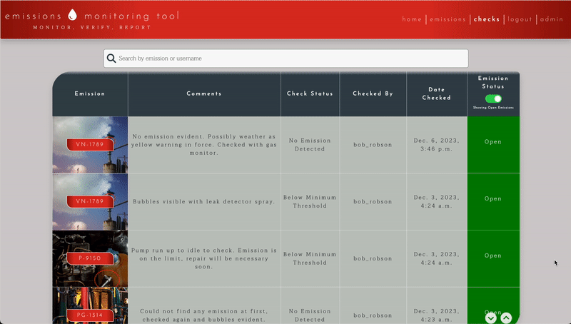
[As a **Site Admin** I can **provide a confirm prompt that fits with site styling** so that **users experience a fluent and seamless styling in all aspects of the site**](https://github.com/johnamdickson/portfolio-project-4/issues/57)|User story will not be implemented in this version of the app.|❌|N/A
[As a **User** I can **exit form without submission using a cancel / go back button in the window as opposed to browser back button** so that **I can navigate from the site at point of use instead of using browser control.**](https://github.com/johnamdickson/portfolio-project-4/issues/58)|Each form has a go back button which enables the user to go back to the previous page without using the browser controls.|✅|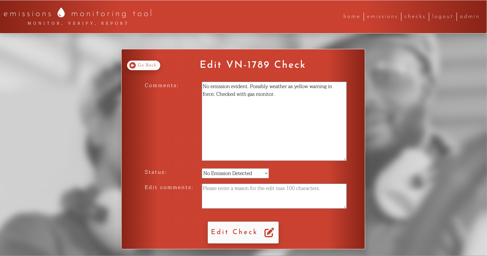
[As a **User** I can **traverse the site using commonly styled buttons** so that **the navigation experience is consistent and intuitive**](https://github.com/johnamdickson/portfolio-project-4/issues/60)|All butons across the site styled for consistency which essentially breaks down as two types: white background/red font and red background/white font.|✅|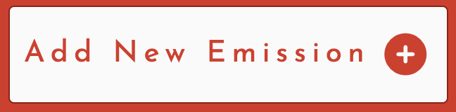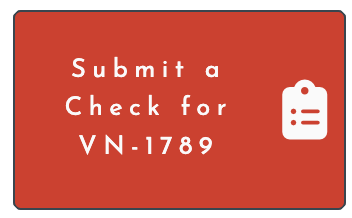
[As a **Site Admin** I can **condense all form htmls into a template for extension** so that **DRY principle can be adhered to.**](https://github.com/johnamdickson/portfolio-project-4/issues/61)|User story will not be implemented in this version of the app.|❌|N/A
[As a **User** I can **log onto the monitoring tool with single sign on** so that **logging is a simple and secure process using a familiar log in**](https://github.com/johnamdickson/portfolio-project-4/issues/63)|User story will not be implemented in this version of the app.|❌|N/A
[As a **Site Admin** I can **check a users log in status** so that **those not logged in are only able to access the home page**](https://github.com/johnamdickson/portfolio-project-4/issues/64)|When no user is logged in, any attempt to access another page such as emissions will result in the user being returned to the login page.|✅|
[As a **Site Admin** I can **ensure that the add emission form contains the correct inputs** so that **unnecessary fields are removed.**](https://github.com/johnamdickson/portfolio-project-4/issues/64)|Current and next check due form fields removed as these values are automatically calculated.|✅|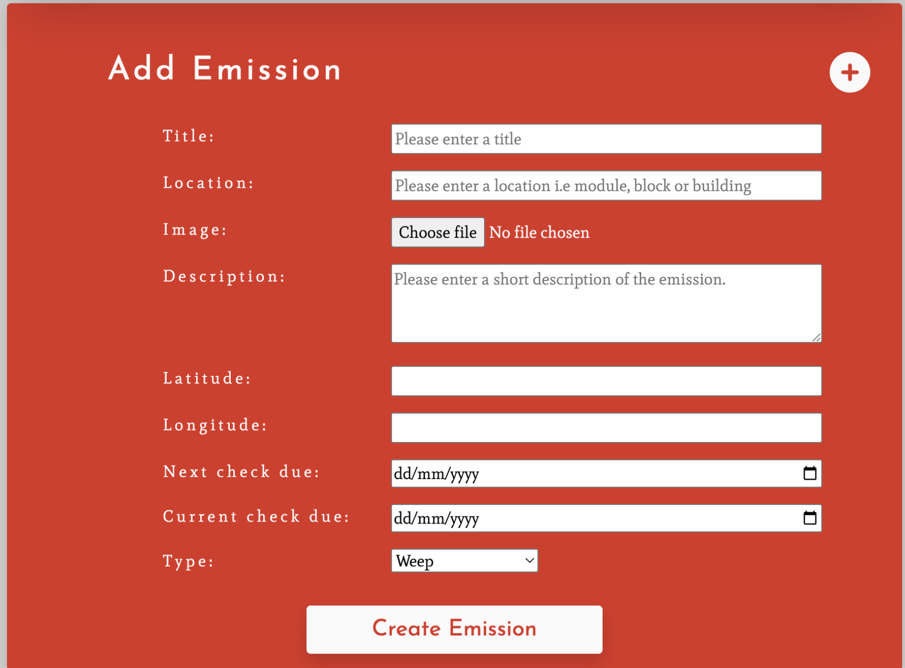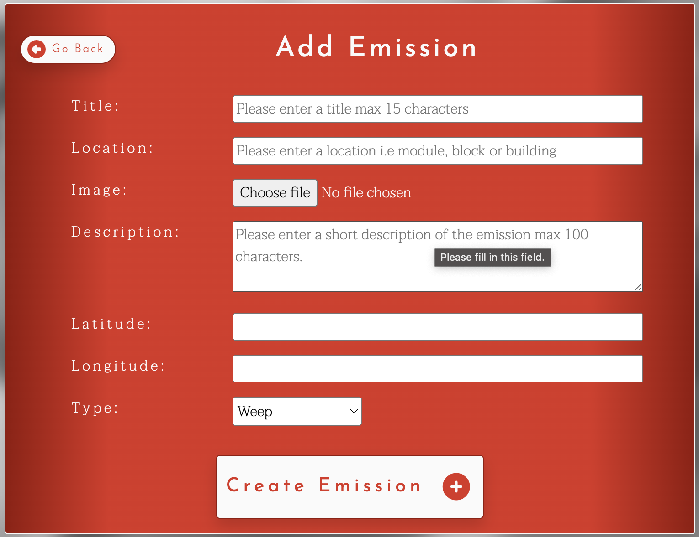

## Validator Testing

### HTML

All HTML pages were checked using the [W3C HTML Validator](https://validator.w3.org/) with the home, login and signup pages checked using address and every other page using page source text input. The text input was obtained by navaigating to the page to test and then right clicking on the window. From the menu, the view page source option was selected which opened a new tab containing the DOM for the page. The test was then performed by copying and pasting the code into the text input field in the validator.

Results for all HTML pages can be found in the table below:

**Page**|**First Pass**|**Warnings/Errors**|**Second Pass (Post Fix)**|**Screenshot**
:-----:|:-----:|:-----|:-----:|:-----:
 | index| ❌ |Warning: Consider adding a lang attribute to the html start tag to declare the language of this document.  Info: Trailing slash on void elements has no effect and interacts badly with unquoted attribute values.   Error: An img element must have an alt attribute, except under certain conditions. Error: Stray end tag div. Error: Stray start tag tr. Error: The aria-labelledby attribute must point to an element in the same document.| ✅ | 
 | emissions| ❌ |Error: An img element must have an alt attribute, except under certain conditions. Error: Attribute value missing. Error: End tag div seen, but there were open elements. Error: No space between attributes. Error: Bad value `${checkEmissionUrl}` for attribute href on element a: Illegal character in path segment: { is not allowed.   Error: Bad value `${allEmissionsUrl}` for attribute href on element a: Illegal character in path segment: { is not allowed. Error: Stray end tag div. Warning: Section lacks heading. Consider using h2-h6 elements to add identifying headings to all sections, or else use a div element instead for any cases where no heading is needed. Error: The aria-labelledby attribute #must point to an element in the same document. | ✅| 
 |emission-detail| ❌ | Error: Element p not allowed as child of element button in this context. (Suppressing further errors from this subtree.)   Error: The element h4 must not appear as a descendant of the th element.   Error: The element h5 must not appear as a descendant of the th element.  Error: Duplicate attribute class. Error: Stray end tag div. Error: The aria-labelledby attribute must point to an element in the same document. Error: Bad value 100% for attribute width on element img: Expected a digit but saw % instead.| ✅|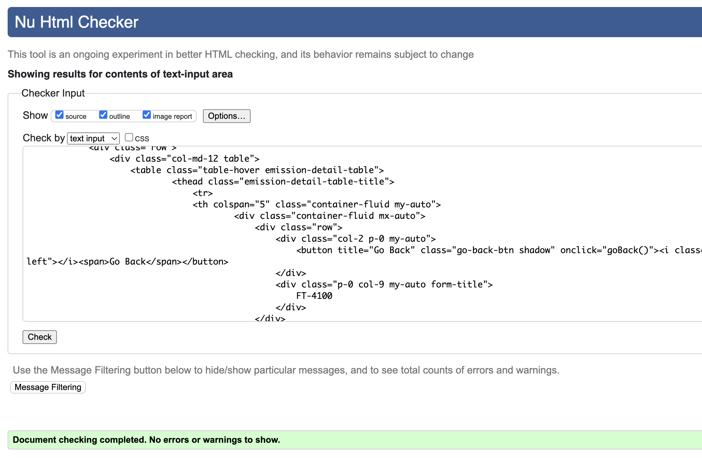 
 |emission-checks | ❌ | Error: No space between attributes. Warning: Section lacks heading. Consider using h2-h6 elements to add identifying headings to all sections, or else use a div element instead for any cases where no heading is needed.  Error: Bad value `${checkEmissionUrl}` for attribute href on element a: Illegal character in path segment: { is not allowed.  Error: Bad value `${allEmissionsUrl}` for attribute href on element a: Illegal character in path segment: { is not allowed. Stray end tag div. Error: The aria-labelledby attribute must point to an element in the same document.| ✅|  
 | login | ❌ |Error: Stray end tag div.  Error: Element p not allowed as child of element button in this context. (Suppressing further errors from this subtree.)  Error: Bad value for attribute action on element form: Must be non-empty. Error: End tag main seen, but there were open elements. Error: Unclosed element div. | ✅ | 
 | logout|❌  | Error: End tag main seen, but there were open elements. Error: Unclosed element div.|✅ | 
 | signup| ❌| Error: Stray end tag div. Error: Duplicate ID help-text. Error: End tag main seen, but there were open elements. Error: Unclosed element div.|✅ | 
 | add-emission| ❌| Error: Bad value for attribute action on element form: Must be non-empty. Error: End tag main seen, but there were open elements. Error: Unclosed element div. Error: Stray end tag a.|✅ |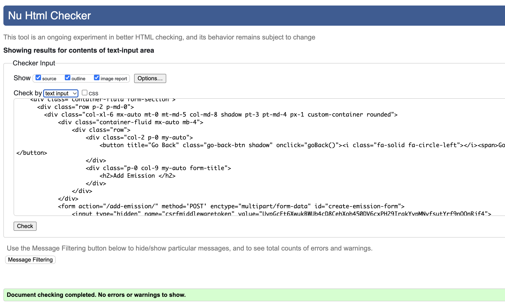 
 | add-check| ❌| Error: Bad value for attribute action on element form: Must be non-empty.  Error: End tag main seen, but there were open elements. Error: Unclosed element div.|✅ | 
 | close-emission| ✅| N/A| N/A | 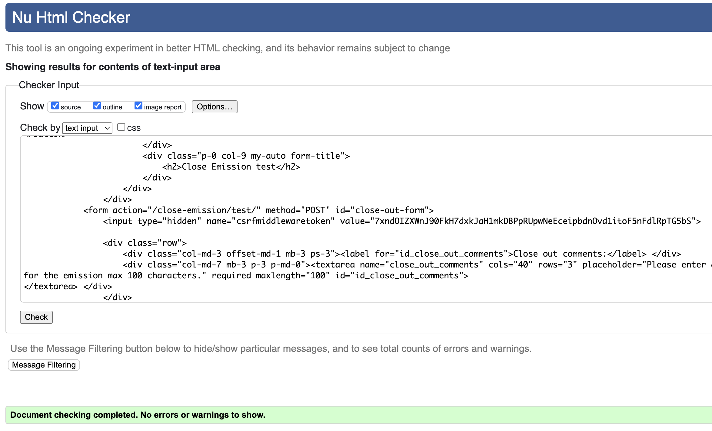 
   | edit-check| ✅| N/A| N/A |   
  | 400 error| ✅| N/A| N/A | 
  | 403 error| ✅| N/A| N/A | 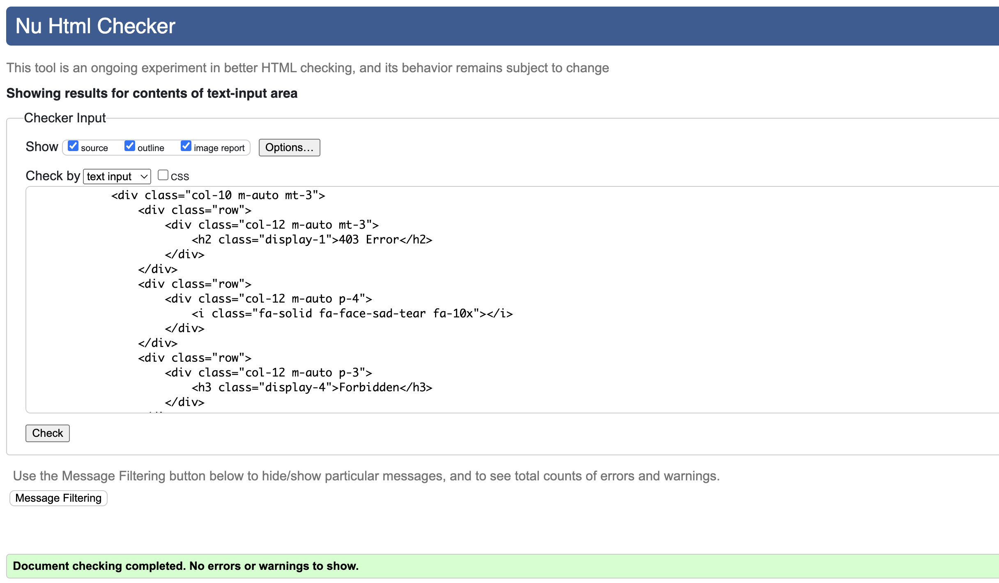 
  | 404 error| ✅| N/A| N/A | 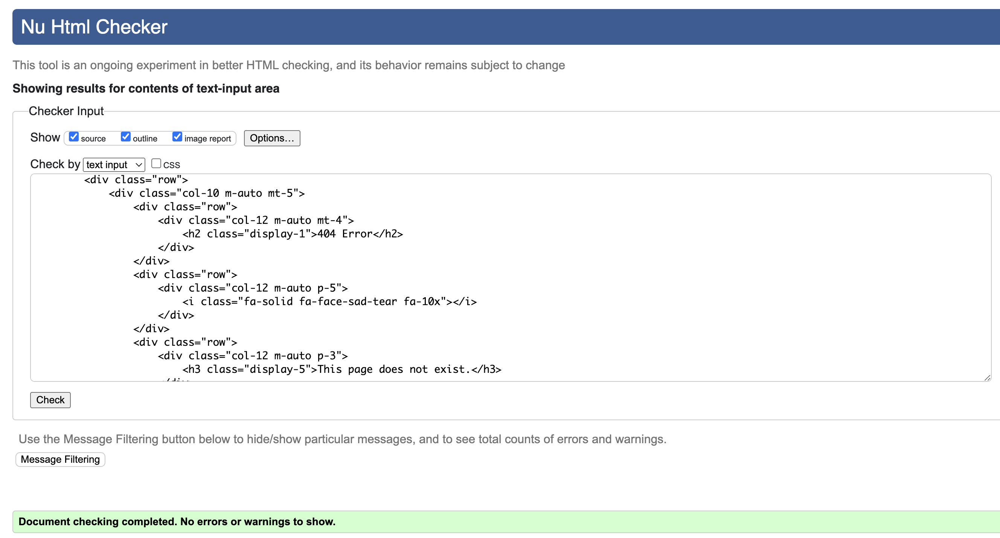 
  | 500 error| ✅| N/A| N/A |  

### CSS

The site CSS was checked using the [W3C CSS Validator](https://jigsaw.w3.org/css-validator/). There were 220 warnings assoiated with Bootstrap CSS and 6 in static CSS file associated with webkit code. These warnings are unavoidable in the validator because they are vendor extensions. However, looking at feedback given to other students on Slack who had a similar issue, it appears to be safe to ignore these warnings. 

The warnings and errors that are detailed in the table below reflect problems within the static CSS file and were duly corrected.

**First Pass**|**Errors**|**Warnings**|**Second Pass (Post Fix)**|**Screenshot**
:-----:|:-----|:-----|:-----:|:-----:
| ❌|Property opaity doesn't exist. The closest matching property name is opacity : 0  Property size doesn't exist. The closest matching property name is resize : 50px Property size doesn't exist. The closest matching property name is resize : 50px|.go-back-btn	Same color for background-color and color  .go-back-button Same color for background-color and border-color|✅| 

### Javascript

The site Javascsript functionality was checked using [JS Hint](https://jshint.com/)

**File**|**Warnings**|**Warnings Remaining (Post Fix)**|**Screenshot**
|:-----:|:-----|:-----|:-----:|
script.js |Warnings returned, click [here](TESTING-files/javascript-validator/script-errors.md) to view|Two undefined variables: bootstrap and google. No action taken as they are vendor API Two unused variables: no action taken as they are all called from DOM events that pass over data from the templates to JS code.| 
script.test.js |Warnings returned, click [here](TESTING-files/javascript-validator/script.test-errors.md) to view|Ten warnings were ignored. Six warnings are attributable to the google maps api and the remaining four are related to Jest testing code Six undefined variables: no action taken as they are all Jest function calls.| 

### Python

Each of the site Python files were passed through the [Code Institute Python Linter](https://pep8ci.herokuapp.com/). Initial errors can be found in this file. The table below list each file with screenshot of the results after resolving errors and warnings.

**File**|**Initial Errors/Warnings**|**Screenshot**
|:-----:|:------|:-----:|
|asgi.py|N/A|
|settings.py|Errors/warnings returned, click [here](TESTING-files/python-validator/settings-errors.md) to view|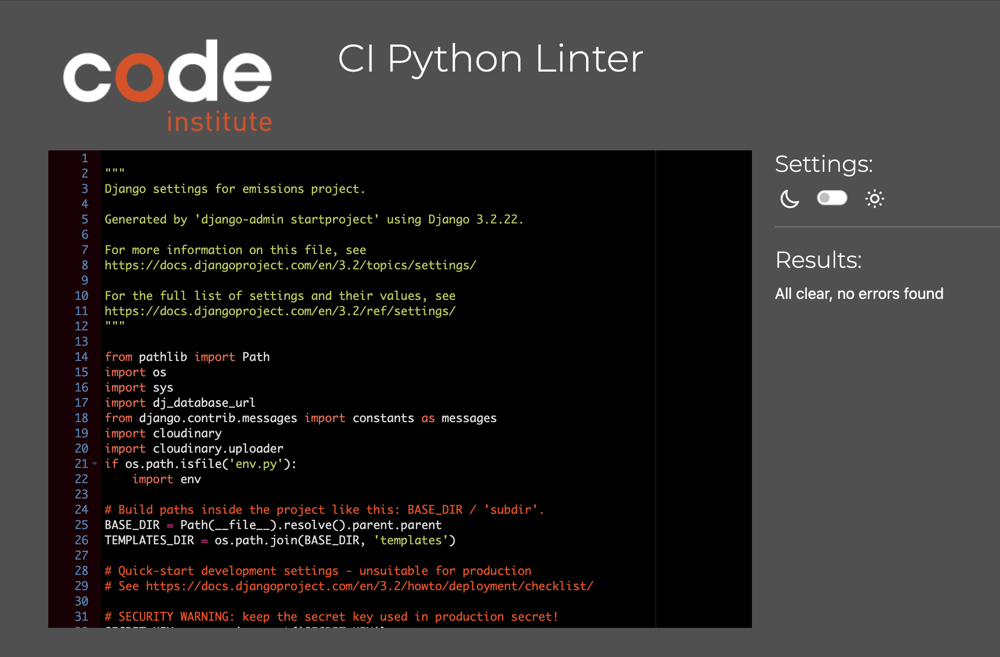
|emissions/urls.py|N/A|
|wsgi.py|N/A|
|admin.py|Errors/warnings returned, click [here](TESTING-files/python-validator/admin-errors.md) to view|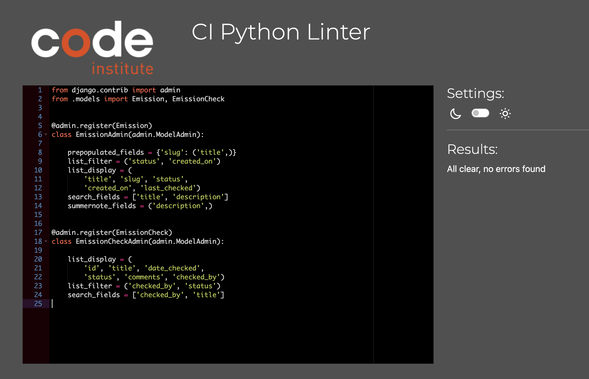
|apps.py|N/A|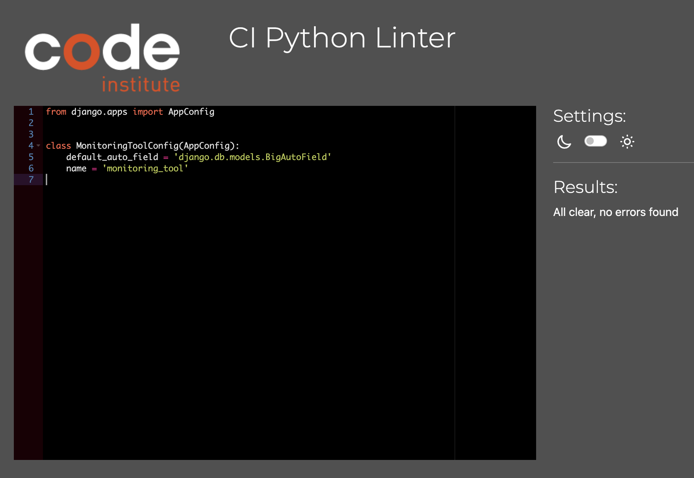
|forms.py|Errors/warnings returned, click [here](TESTING-files/python-validator/forms-errors.md) to view|
|models.py|Errors/warnings returned, click [here](TESTING-files/python-validator/models-errors.md) to view|
|tests.py|Errors/warnings returned, click [here](TESTING-files/python-validator/tests-errors.md) to view|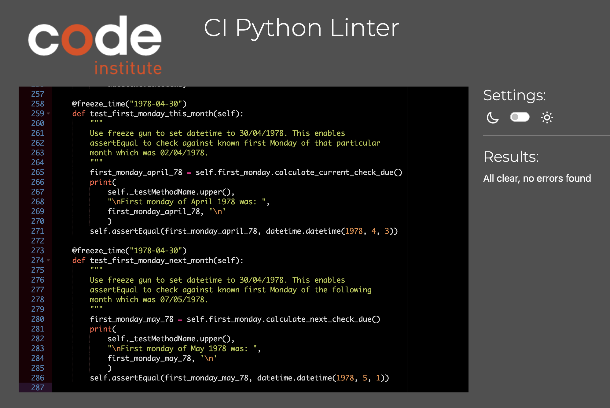
|monitoring_tool/urls.py|Errors/warnings returned, click [here](TESTING-files/python-validator/monitoring_tool-urls-errors.md) to view|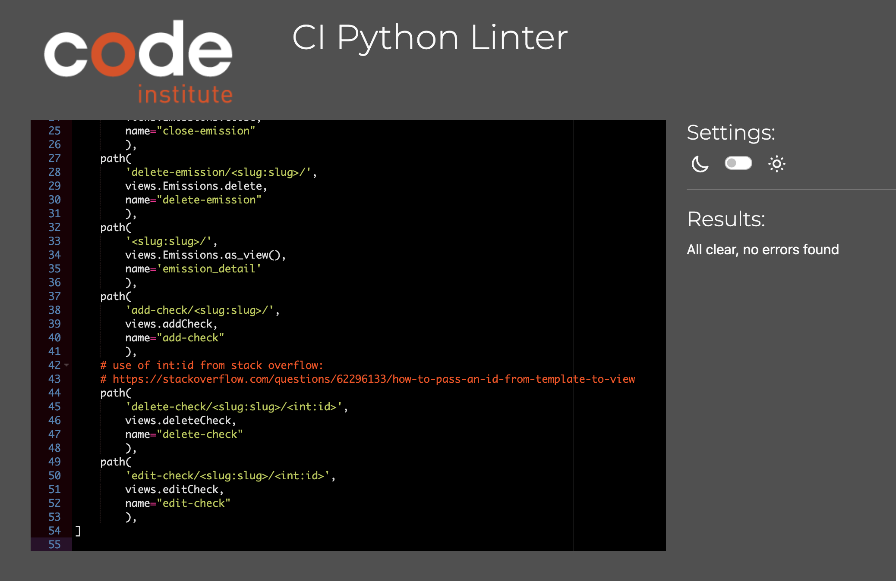
|views.py|Errors/warnings returned, click [here](TESTING-files/python-validator/views-errors.md) to view|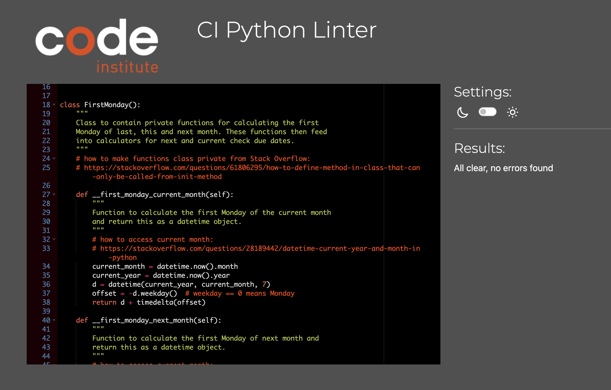

### Lighthouse

All HTML pages were checked using [Chrome DevTools Lighthouse](https://developer.chrome.com/docs/lighthouse/overview/). The results were generally optimal for desktop devices as shown in the table below. The status code pages returned an error on Lighthouse in Navigation mode, possibly owing to the fact that they redirect after a countdown period. Based on their content simplicity and the fact they should be rarely accessed, the Snapshot mode was selected. Each page returned the same score which is shown at the bottom of the table.

For mobile devices, the performance score was in the 60-70 region. This was improved by changing the image format to webp and moving all scripts to bottom of body with the exeption of those essential to the page function. The Google maps API also affected performance, especially on the emissions detail page where the map is rendered. Upon researching this performance dip it would appear that this is commonplace and to be expected without any countermeasures involving workarounds. These countermeasures and any further alterations towards improving the mobile performance score were considered but in the interests of project progress this was not implemented.
**File**|**Desktop Results**|**Mobile Results**|
|:-----:|:-----:|:-----:|
|index.html|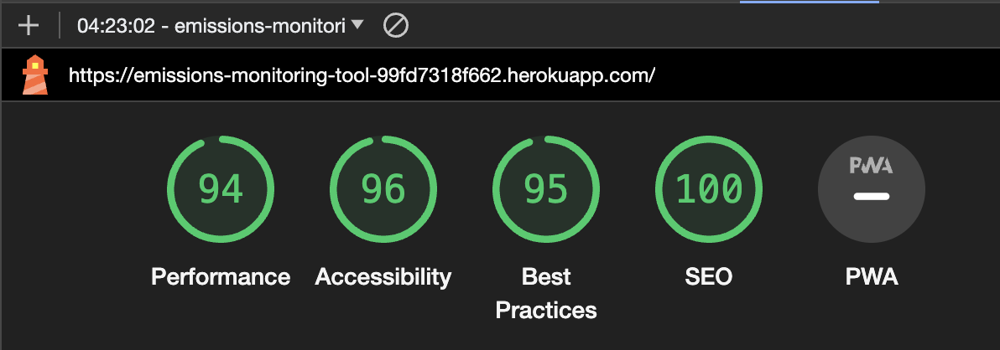|
|emissions.html||
|emission-detail.html|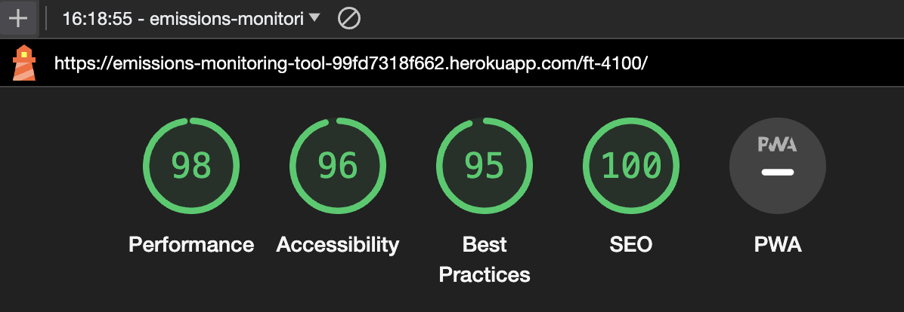|
|emission-checks.html||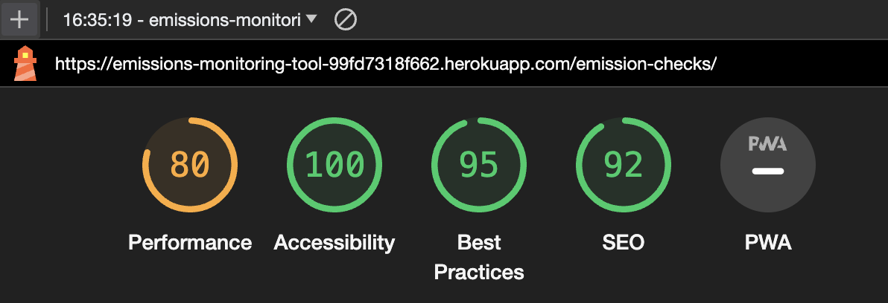
|login.html|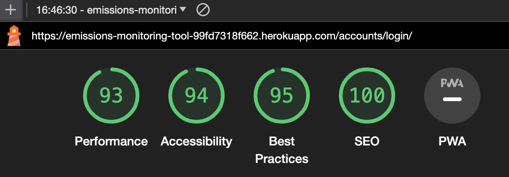|
|logout.html|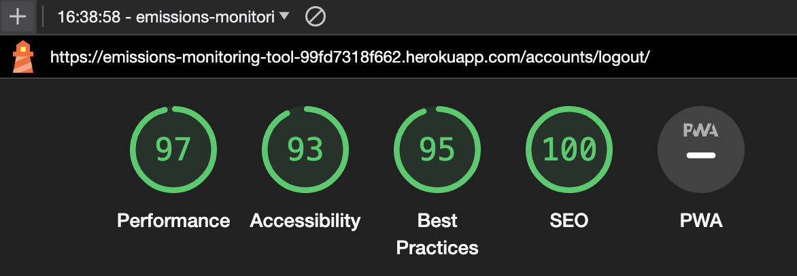|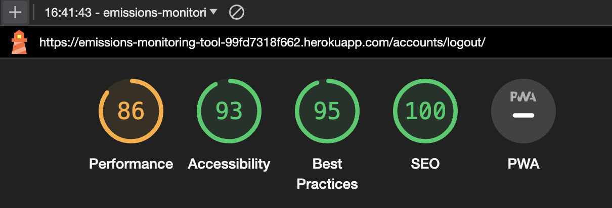
|signup.html|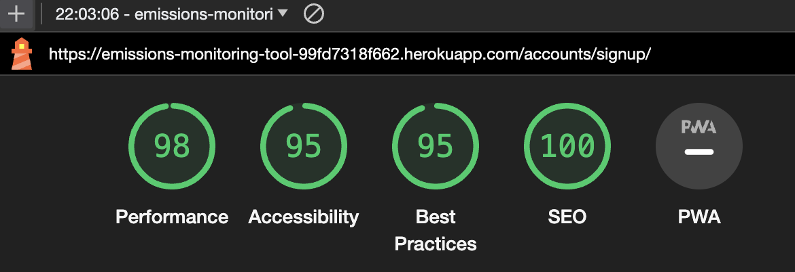|
error-pages|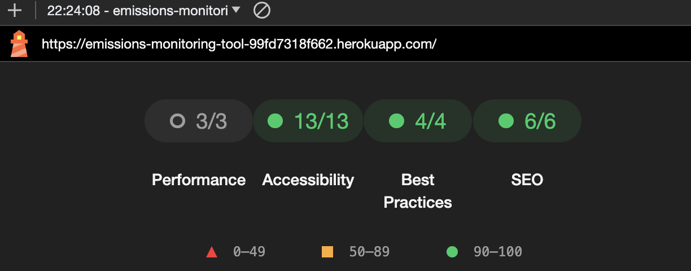|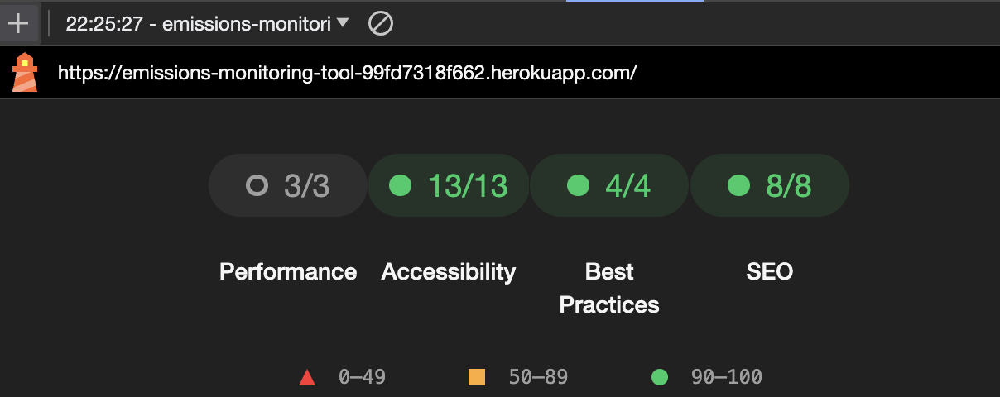

## Responsiveness Testing

### Browser Testing

The app was tested on Chrome, Firefox, Safari and Microsoft Edge. The appearance and responsiveness on each platform was satisfactory. The only exception was an anomaly observed on Safari, where the background colour of the status cells on emissions and emissions checks tables is applied after the page loads or the filter toggle switch is moved. The result is a stepped transition which looks out of place with other transitions in the app and can be seen in the gif below. This is a minor issue so will not be addressed in the first revision of the the app. It will be recorded as an [unresolved bug](https://github.com/johnamdickson/portfolio-project-4/issues/87) with a view to resolving in any future app updates.  

### Device Testing

**Device**|**Summary**|**Screenshot**|
|:-----:|:------|:-----:|
|iPhone 12 Pro Max  (Physical Device)|The app's responsiveness was tested on a physical device and the results were satisfactory with only two minor issues. The first issue is as previously described in browser testing whereby the status cell background colour transition is stepped in appearance. This makes sense given iOS uses Safari as the main browser and any resolution will be considered during future updates. The second issue relates to the overlay text in emissions and emissions checks tables being difficult to read. The font-weight was changed to 400 to try and make the text stand out more.  The only other comment to make regarding responsiveness on small and extra-small screen sizes is that the emission and emission checks table columns will not fit within the screen width and must be scrolled to view. At 982 pixel width and below some of the columns are hidden, however hiding more on small and extra small screens would be detrimental to the communication of the pertinent data. There was no action taken to resolve this given it is obvious that the table needs to be scrolled in the x and y axis and also the app is designed more with tablets and laptops in mind.   All of the physical device test screenshots can be found [here.](TESTING-files/responsiveness-testing/device-testing)||
|iPhone 6/7/8  (Simulated Device)| The responsiveness for these devices was simulated on Chrome Devtools and confirmed to be satisfactory.|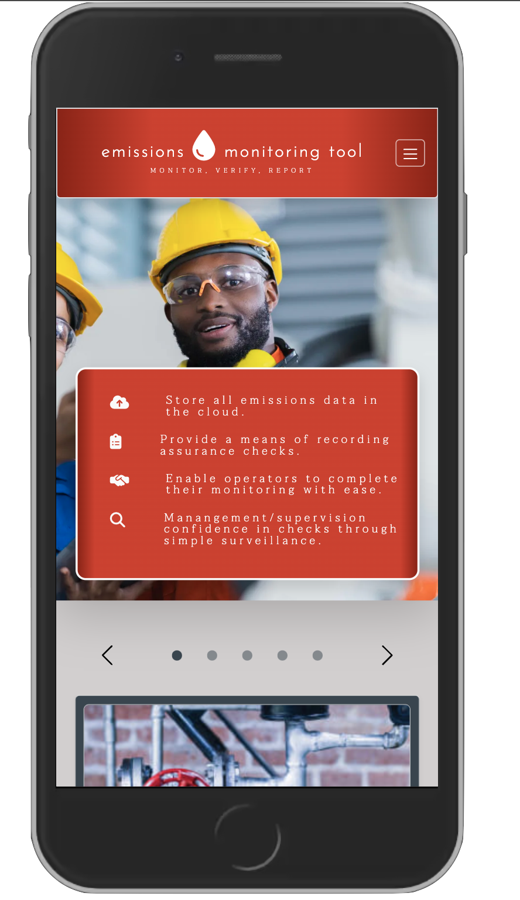
|Samsung Galaxy S8+  (Simulated Device)| The responsiveness for this device was simulated on Chrome Devtools and confirmed to be satisfactory.|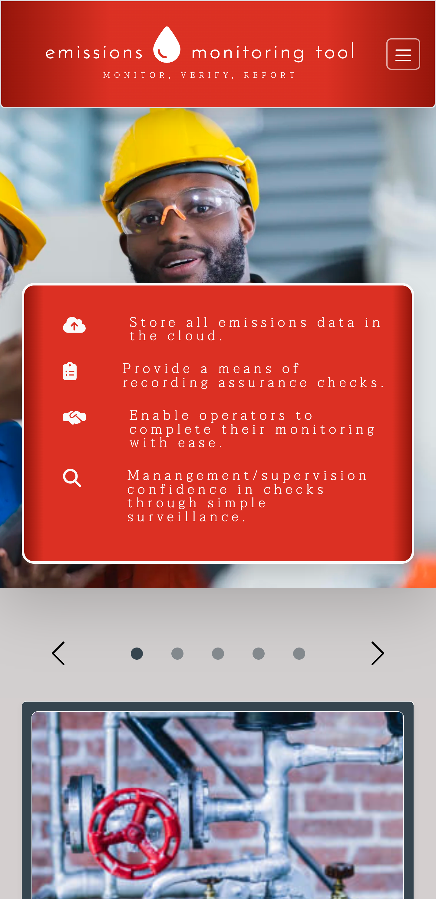
|iPad (Simulated Device)| The responsiveness for this device was simulated on Chrome Devtools and confirmed to be satisfactory.|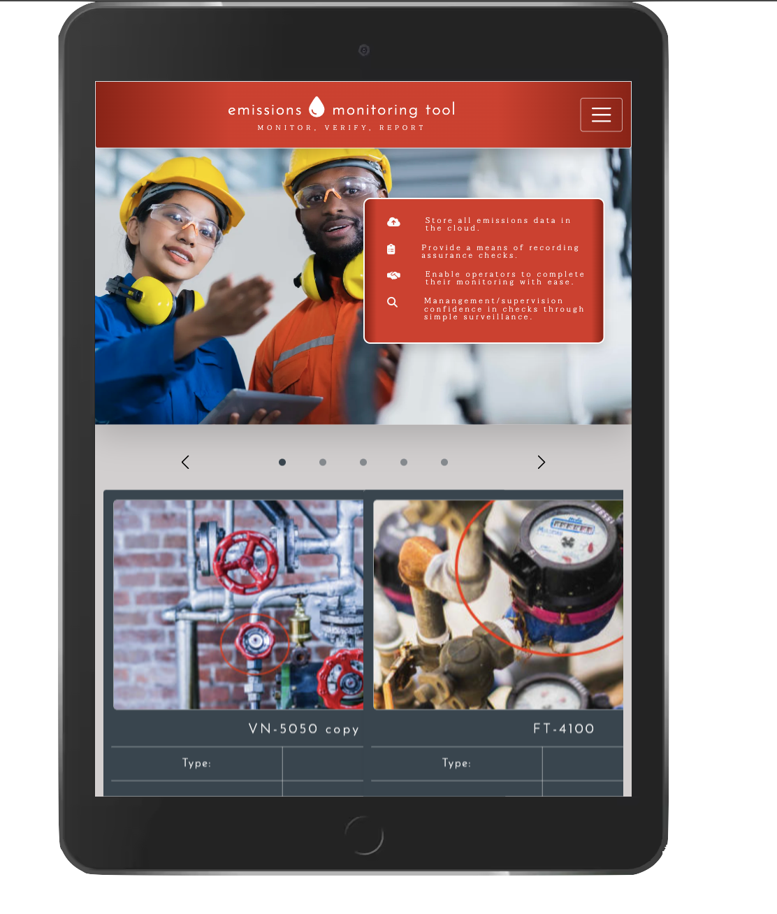
|iPad Pro (Simulated Device)| The responsiveness for this device was simulated on Chrome Devtools and confirmed to be satisfactory.|
|Desktop/Laptop Screen Width 1024 (Simulated Device)| The responsiveness for this screensize was simulated on Chrome Devtools and confirmed to be satisfactory.|
|Desktop/Laptop Screen Width 1440 (Simulated Device)| The responsiveness for this screensize was simulated on Chrome Devtools and confirmed to be satisfactory.|

## Automated Testing

### Python Automated Testing
Automated testing was completed on the Emission class methods and the First Monday class methods using the built in Django TestCase class. The individual test cases and results are shown in the table below:
**Test**|**Test Description**|**Result**                                              
|:-----|:------|:------|
|test_login_ verified_user| Checks if verified user created in set up can log in. Performs two assertions - checks user is verified and confirms if request has been successful.||
|test_non_ verified_user| Test non-verified user trying to access any page other than home, in this case emissions. Assert redirect should confirm an initial 302 error with a target status code of 200 once redirected to login page.||
|test_adding_ emission_no_perms| Test base user trying to add an emission. Assert equal should confirm a 403 error indicating this operation IS NOT allowed for this particular user.||
|test_adding_ emission_with_perms| Test admin_user with emission_admin rights trying to add an emission. Assert equal should confirma 200 status code indicating this operation IS allowed for this particular user.||
|test_emission_ deletion_no_perms| Test admin_user trying to delete an emission. Assert equal should confirm a 403 status code indicating this operation IS NOT allowed for this particular user.||
|test_emission_ deletion_with_perms| Test superuser trying to delete an emission. Assert equal should confirm a 200 status code indicating this operation IS allowed for this particular user.||
|test_return_ datetime| Test that the first monday functions return a datetime object.||
|test_first_monday_this_month| Use freeze gun to set datetime to 30/04/1978. This enables assertEqual to check against known first Monday of that particular month which was 03/04/1978.||
|test_first_monday_next_month| Use freeze gun to set datetime to 30/04/1978. This enables assertEqual to check against known first Monday of the following month which was 01/05/1978.|
### Javascript Automated Testing
Javascript testing was completed using Jest. The only function tested is the errorCountdown (used to create a countdown prior to automatic redirect on HTTP Status Code error pages) as all of the other functions would require a more complex set up to test their functionality fully. Given the time constraints of the project, the remaining functionality would be manually tested. Each test essentially checks for the same seven elements: 
1. Timer set to correct time on page load (60 seconds for 400 and 500 pages, 10 seconds 403 and 404).
2. A check to ensure that the timer is halfway through the countdown (30 or 5 seconds).
3. A check to ensure that the timer is completed and at 0.
4. A check to ensure an h2 exists.
5. A check to ensure the h2 has the correct error code string.
6. A check to ensure an h3 exists.
7. A check to ensure the h3 has the correct error description. 

The test running can be viewed [here.](TESTING-files/automated-testing/javascript-automated-testing/jest-tests.gif) 
The test results can be seen in the image below:


## Manual Testing
Each feature and action on every page of the app was tested manually to verify the correct function of the site. The results are detailed per page

### Home Page

 **Feature** | **Expected Outcome** | **Testing Performed** | **Testing Outcome** | **Result** |
|:-----|:------|:------|:-----|:------|
Navbar Menu Items Styling|The home navbar link should be a bolder font on page load to indicate where on the site the user is.|Load home page|The home navbar menu item is a bolder font than the others.|✅|
|Site Logo|Clicking on logo will return user to the home page|Clicked on logo|Home page reloaded|✅|
|Carousel Control Buttons|Clicking on either of the carousel control buttons moves the carousel by one card|Left button and right button clicked|Carousel moved in the direction expected|✅|
|Carousel Indicators|Active carousel indicator will be more opaque than inactive indicators and active indicator will move depending on which card is in focus|Clicked carousel control button a number of times|Active carousel indicator changed depending on which card was in focus. The active indicator more opaque than inactive indiactors|✅|
|Carousel Card|On hover the carousel card background colour will alter and pointer appear|Moved cursor over the top of one of the carousel cards|Cursor changed to pointer and the background colour changed subtly to indicate the card is being hovered over|✅|
|Carousel Card|When clicking a card, a modal will appear with further information on the emission selected.|Selected a card and clicked|Modal appeared as expected|✅|
|Home Page Modal - Submit Check Button|When clicking on the submit emission check button it should redirect the user to the submit check page for the emission selected|Opened modal and clicked the submit emission check button|User is redirected to the submit check page for the correct emission|✅|
Home Page Modal - Emission Detail Button |When clicking on the go to emission detail page button it should redirect the user to the emission detail page for the emission selected|Opened modal and clicked the go to emission detail page button|User is redirected to the emission detail page for the correct emission|✅|
Home Page Modal - Go To All Emissions Page Button|When clicking on the go to all emissions page button it should redirect the user to the emissions page.|Opened modal and clicked the go to all emissions page button|User is redirected to the emissions page.|✅|
Home Page Modal - All Buttons(except close button)|When hovering over all buttons the font should change colour and the background opacity should reduce.|Hovered over all three of the home page modal buttons|The font changed colour and the background opacity reduced as expected|✅|
Home Page Modal - Close Button|When clicking on the close button, the modal should be dismissed.|Opened home page modal and clicked on the close button| Home page modal was dismissed|✅|
Social Media Link|Clicking on the LinkedIn icon in the footer should open the app home page in a new tab|Clicked on the LinkedIn icon|A new tab opened directing the user to the LinkedIn home page|✅|
Social Media Link|On hover the LinkedIn icon should change colour|Moved cursor over the social media link|The LinkedIn icon changed colour to blue|✅|

### Emissions Page

 **Feature** | **Expected Outcome** | **Testing Performed** | **Testing Outcome** | **Result** |
|:-----|:------|:------|:-----|:------|
Navbar Menu Items Styling|The emissions navbar link should be a bolder font on page load to indicate where on the site the user is.|Load emissions page|The emissions navbar menu item is a bolder font than the others.|✅|
|Site Logo|Clicking on logo will return user to the home page|Clicked on logo|Home page reloaded|✅|
|Add New Emission Button - with permission to add an emission|Clicking the Add New Emission button should direct the user to the add emission page|Add New Emission button clicked| User is redirected to the add emission page|✅|
|Add New Emission Button - without permission to add an emission|Clicking the Add New Emission button should generate an alert informing the user that they do not have permissions to add a new emission|Add New Emission button clicked| An alert appears informing the user that they are not able to add an emission|✅|
|Add New Emission Button - User Dependant Styling|The Add Emission button should be styled to appropriately depending on user status. For superusers and emission admin users the button should be a white back ground with red font. For base emission users the button background and font colours opacity should be reduced to indicate it is not available.|Logged in as different users with the three permissions detailed previously| The button is styled as expected for all three different users.|✅|
|Add New Emission Button - User Dependant Hover Styling|For superusers and emission admin users the Add Emission button background font and border colour should all change on hover. For base emission users the button background and font colours should remain the same and a not-allowed cursor should appear.|Logged in as different users with the three permissions detailed previously and hovered over Add Emission button| The button is styled on hover as expected for all three different users. The not-allowed cursor appears when the base emission user hovers over button.|✅|
|Emissions Table Checks Complete Column|There should be coloured icons for different check statuses:  
For checks complete&nbsp;&nbsp;&nbsp;&nbsp;&nbsp;&nbsp;&nbsp;
 
For checks outstanding&nbsp;&nbsp;&nbsp;&nbsp;
 
For no checks completed&nbsp;
  | Opened emissions page and scrolled to emissions table.|The three different icons are present in the table for the correct check statuses|✅|
|Emission Table Status Column - Toggle Switch|On page load, only open emissions should displayed in the table.| Load page and scroll to emissions table|The open emissions are displayed and the closed ones are not displayed.|✅|
|Emission Table Status Column - Toggle Switch| The toggle switch in the `<th>` cell of the status column should filter Closed emissions and the switch subtitle should change accordingly to indicate what the column is displaying| Click the toggle switch to both available positions|The Closed emissions were filtered/not filtered depending on the switch position and the switch subtitle changed from *Showing Open Emissions* to *Showing Open & Closed Emissions*.|✅|
|Emission Table Status Column - Background Colour|There should be a different background colour depending on the status - green for Open and red for Closed|Opened emissions page and scrolled to emissions table.|The status dependant background colour is correct for the two different statuses|✅|
|Emission Table Row - Hover| When an emission table row is hovered over, the row background colour should darken slightly and the cursor should change to a pointer.|Move cursor onto an emission table row.| Row background colour and cursor changed as expected|✅|
|Emission Table Row - Click| When an emission table row is clicked, a modal should open with the emission selected indicated in the modal title| Click on an emission table row| A modal appeared which had the emission selected in the modal title|✅|
|Emission Table - Scroll Buttons| There should be an up and down button for scrolling the table inside a set height container to the top and bottom respectively. When the table is scrolled to the top, the up button opacity should be reduced. Similarly when the table is scrolled to the bottom, the down button opacity should be reduced. In between the top and bottom position, both buttons should be fully opaque.|Pressed both up and down buttons and scrolled table manually between top and bottom of table.| The buttons opacity reduced dependant on the table scrollview being at the top or bottom. Both buttons were fully opaque between the top and bottom positions.|✅|
|Emissions Page Modal - Submit Check Button|When clicking on the submit emission check button it should redirect the user to the submit check page for the emission selected|Opened modal and clicked the submit emission check button|User is redirected to the submit check page for the correct emission|✅|
|Emissions Page Modal - Go To Emission Detail Page Button|When clicking on the go to emission detail page button it should redirect the user to the emission detail page for the emission selected|Opened modal and clicked the go to emission detail page button|User is redirected to the emission detail page for the correct emission|✅|
|Emissions Page Modal - All Buttons(except close button)|When hovering over all buttons the font should change colour and the background opacity should reduce.|Hovered over both of the emissions page modal buttons|The font changed colour and the background opacity reduced as expected|✅|
|Emissions Page Modal - Close Button|When clicking on the close button, the modal should be dismissed.|Opened home page modal and clicked on the close button| Home page modal was dismissed|✅|
|Screen width <= 982px|Location, Created On and Next Check Due columns should be hidden from the user when screen width is 982px or below and reappear when screen width is above 982px. |Using Chrome Devtools, reduced the screen width to 982px then below before returning width to above 982px.| The Location, Created On and Next Check Due columns were hidden from the user at 982px and below. The columns reappeared when the screen width was brought above 982px.|✅|

### Checks Page

 **Feature** | **Expected Outcome** | **Testing Performed** | **Testing Outcome** | **Result** |
|:-----|:------|:------|:-----|:------|
Navbar Menu Items Styling|The checks navbar link should be a bolder font on page load to indicate where on the site the user is.|Load checks page|The checks navbar menu item is a bolder font than the others.|✅|
|Site Logo|Clicking on logo will return user to the home page|Clicked on logo|Home page reloaded|✅|
|Search Bar|Typing a string into the search bar should filter the checks table based on the emission title or checked by.|Typed `P-9150` and `john_doe` into the Search Bar|The checks table filtered per the tag number and username entered.|✅|
|Checks Table Status Column - Toggle Switch|On page load, only open emission checks should be displayed in the table.| Load page and scroll to checks table|The open emission checks are displayed and the closed ones are not displayed.|✅|
|Checks Table Status Column - Toggle Switch| The toggle switch in the `<th>` cell of the status column should filter Closed emission checks and the switch subtitle should change accordingly to indicate what the column is displaying| Click the toggle switch to both available positions|The Closed emission checks were filtered/not filtered depending on the switch position and the switch subtitle changed from *Showing Open Emissions* to *Showing Open & Closed Emissions*.|✅|
|Checks Table Row - Hover| When a checks table row is hovered over, the row background colour should darken slightly and the cursor should change to a pointer.|Move cursor onto an checks table row.| Row background colour and cursor changed as expected|✅|
|Checks Table Row - Click| When checks table row is clicked, a modal should open with the emission selected indicated in the modal title.| Click on a check table row| A modal appeared which had the emission selected in the modal title|✅|
|Checks Table - Scroll Buttons| There should be an up and down button for scrolling the table inside a set height container to the top and bottom respectively. When the table is scrolled to the top, the up button opacity should be reduced. Similarly when the table is scrolled to the bottom, the down button opacity should be reduced. In between the top and bottom position, both buttons should be fully opaque.|Pressed both up and down buttons and scrolled table manually between top and bottom of table.| The buttons opacity reduced dependant on the table scrollview being at the top or bottom. Both buttons were fully opaque between the top and bottom positions.|✅|
|Checks Page Modal - Submit Check Button|When clicking on the submit emission check button it should redirect the user to the submit check page for the emission selected|Opened modal and clicked the submit emission check button|User is redirected to the submit check page for the correct emission|✅|
|Checks Page Modal - Edit Check Button|When clicking on the edit emission check button it should redirect the user to the edit check page for the check selected|Opened modal and clicked the edit check button|User is redirected to the edit check page for the correct check|✅|
|Checks Page Modal - All Available Buttons(except close button)|When hovering over available buttons the font should change colour and the background opacity should reduce.|Hovered over all available checks page modal buttons|The font changed colour and the background opacity reduced as expected|✅|
|Checks Page Modal - Close Button|When clicking on the close button, the modal should be dismissed.|Opened home page modal and clicked on the close button| Home page modal was dismissed|✅|
|Checks Page Modal - Delete Button (logged in asd non-superuser)|Delete Button only be visible to a superuser.|Signed in as non-superuser and opened modal to check for delete button.|Delete button not visible|✅|
|Checks Page Modal - Delete Button(logged in as superuser)|Should be available to superuser and when clicked should display a confirmation dialogue box which when confirmed will delete the check from the database. On deletion the user should be notified.|Signed in as superuser and clicked delete button and then clicked OK on confirmation dialogue.|Delete button visible to superuser and when clicked generated a confirmation dialogue. Clicking OK on dialogue deleted the check from DB and redirected user to the checks page where an alert notified the user that the check was successfully deleted|✅|
|Checks Page Modal - Edit Button(check submitted <24 hours ago)|Button should only be available to the person that submitted the check or a superuser. For any other user, the button should be styled as unavailable with the background and font opacity reduced. On clicking the button the user should be redirected to the edit check page for the check selected.|Logged in as user that did not submit check, then as superuser and then as user who did submit the check. Edit button then clicked.| Edit button styled unavailable for user that did not submit the check. Button is available for the superuser and user who did submit the check. The edit check page for the selected check was loaded when the button was clicked.|✅|
|Checks Page Modal - Edit Button(check submitted >24 hours ago)|Button should be unavailable for all users except the superuser. If user is not a superuser and clicks the button then they should be notified that they cannot edit the check after 24h hours| Logged in as user that did not submit the check, superuser and user who did submit the check. |Button was unavailable for all users with exception of the superuser. When the button was clicked by a non-superuser an alert was generated to inform the user that a check can only be edited for up to 24 hours after submission|✅|
|Screen width <= 982px|Comments column should be hidden from the user when screen width is 982px or below and reappear when screen width is above 982px. |Using Chrome Devtools, reduced the screen width to 982px then below before returning width to above 982px.| The comments column was hidden from the user at 982px and below. The column reappeared when the screen width was brought above 982px.|✅|

