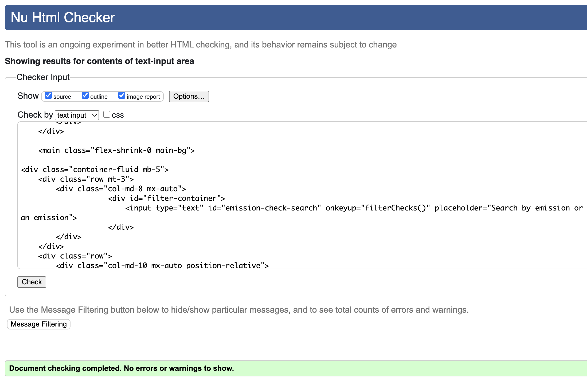
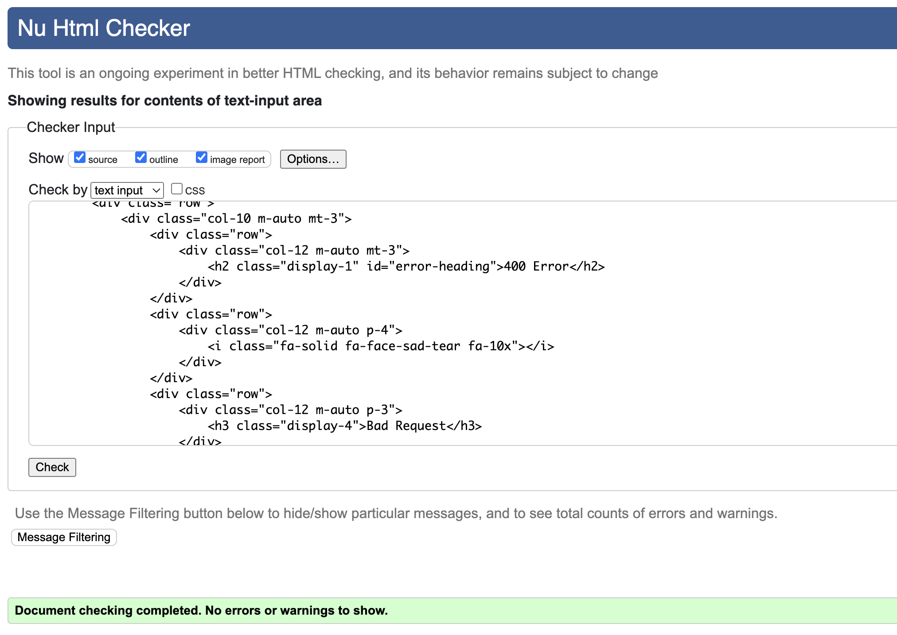
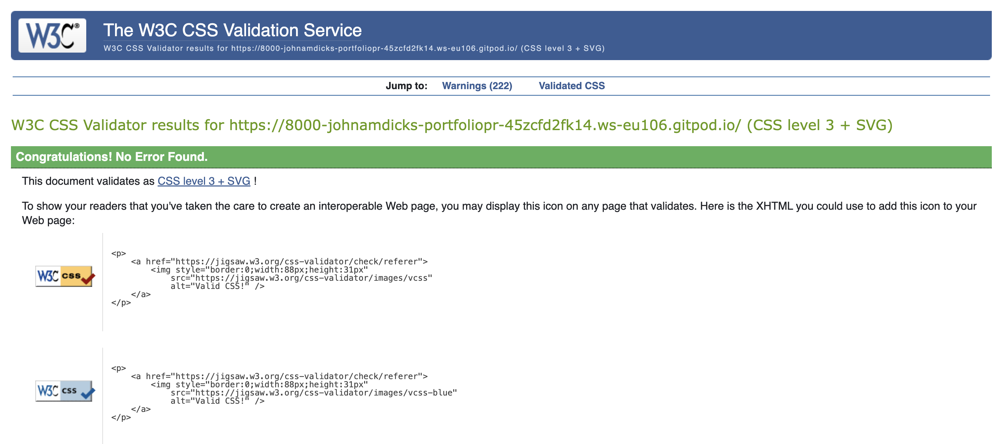

# Table of Contents
- [User Story Testing](#user-story-testing)
- [Validator Testing](#validator-testing)
  * [HTML](#html)
  * [CSS](#css)
  * [Javascript](#javascript)
  * [Python](#python)
  * [Lighthouse](#lighthouse)
- [Browser Testing](#browser-testing)
- [Device Testing](#device-testing)
- [Automated Testing](#automated-testing)
- [Manual Testing](#manual-testing)
- [Bugs](#bugs)
  * [Fixed Bugs](#fixed-bugs)

  * [Unfixed bugs:](#unfixed-bugs-)

## Validator Testing

### HTML

All HTML pages were run through the [W3C HTML Validator](https://validator.w3.org/) with the home page checked using address and every other page using page source text input. The text input was obtained by navaigating to the page to test and then right clicking on the window. From the menu, the view page source option was selected which opened a new tab containing the DOM for the page. The test was then performed by copying and pasting the code into the text input field in the validator.

Results for all HTML pages can be found in the table below:

**Page**|**First Pass**|**Warnings/Errors**|**Second Pass (Post Fix)**|**Screenshot**
:-----:|:-----:|:-----|:-----:|:-----:
 | index| ❌ |Warning: Consider adding a lang attribute to the html start tag to declare the language of this document.  Info: Trailing slash on void elements has no effect and interacts badly with unquoted attribute values.   Error: An img element must have an alt attribute, except under certain conditions. Error: Stray end tag div. Error: Stray start tag tr. Error: The aria-labelledby attribute must point to an element in the same document.| ✅ | 
 | emissions| ❌ |Error: An img element must have an alt attribute, except under certain conditions. Error: Attribute value missing. Error: End tag div seen, but there were open elements. Error: No space between attributes. Error: Bad value `${checkEmissionUrl}` for attribute href on element a: Illegal character in path segment: { is not allowed.   Error: Bad value `${allEmissionsUrl}` for attribute href on element a: Illegal character in path segment: { is not allowed. Error: Stray end tag div. Warning: Section lacks heading. Consider using h2-h6 elements to add identifying headings to all sections, or else use a div element instead for any cases where no heading is needed. Error: The aria-labelledby attribute #must point to an element in the same document. | ✅| 
 |emission-detail| ❌ | Error: Element p not allowed as child of element button in this context. (Suppressing further errors from this subtree.)   Error: The element h4 must not appear as a descendant of the th element.   Error: The element h5 must not appear as a descendant of the th element.  Error: Duplicate attribute class. Error: Stray end tag div. Error: The aria-labelledby attribute must point to an element in the same document. Error: Bad value 100% for attribute width on element img: Expected a digit but saw % instead.| ✅| 
 |emission-checks | ❌ | Error: No space between attributes. Warning: Section lacks heading. Consider using h2-h6 elements to add identifying headings to all sections, or else use a div element instead for any cases where no heading is needed.  Error: Bad value `${checkEmissionUrl}` for attribute href on element a: Illegal character in path segment: { is not allowed.  Error: Bad value `${allEmissionsUrl}` for attribute href on element a: Illegal character in path segment: { is not allowed. Stray end tag div. Error: The aria-labelledby attribute must point to an element in the same document.| ✅|  
 | login | ❌ |Error: Stray end tag div.  Error: Element p not allowed as child of element button in this context. (Suppressing further errors from this subtree.)  Error: Bad value for attribute action on element form: Must be non-empty. Error: End tag main seen, but there were open elements. Error: Unclosed element div. | ✅ | 
 | logout|❌  | Error: End tag main seen, but there were open elements. Error: Unclosed element div.|✅ | 
 | signup| ❌| Error: Stray end tag div. Error: Duplicate ID help-text. Error: End tag main seen, but there were open elements. Error: Unclosed element div.|✅ | 
 | add-emission| ❌| Error: Bad value for attribute action on element form: Must be non-empty. Error: End tag main seen, but there were open elements. Error: Unclosed element div. Error: Stray end tag a.|✅ | 
 | add-check| ❌| Error: Bad value for attribute action on element form: Must be non-empty.  Error: End tag main seen, but there were open elements. Error: Unclosed element div.|✅ | 
 | close-emission| ✅| N/A| N/A |  
   | edit-check| ✅| N/A| N/A |   
  | 400 error| ✅| N/A| N/A | 
  | 403 error| ✅| N/A| N/A |  
  | 404 error| ✅| N/A| N/A |  
  | 500 error| ✅| N/A| N/A |  

### CSS

The site was run through the [W3C CSS Validator](https://jigsaw.w3.org/css-validator/). There were 220 warnings assoiated with Bootstrap CSS and 6 in static CSS file associated with webkit code. These warnings are unavoidable in the validator because they are vendor extensions. However looking at feedback given to other students on Slack who had a similar issue, it appears to be safe to ignore these warnings. 

The warnings and errors that are detailed in the table below reflect problems within the static CSS file and were duly corrected.

**First Pass**|**Errors**|**Warnings**|**Second Pass (Post Fix)**|**Screenshot**
:-----:|:-----|:-----|:-----:|:-----:
| ❌|Property opaity doesn't exist. The closest matching property name is opacity : 0  Property size doesn't exist. The closest matching property name is resize : 50px Property size doesn't exist. The closest matching property name is resize : 50px|.go-back-btn	Same color for background-color and color  .go-back-button Same color for background-color and border-color|✅| 
